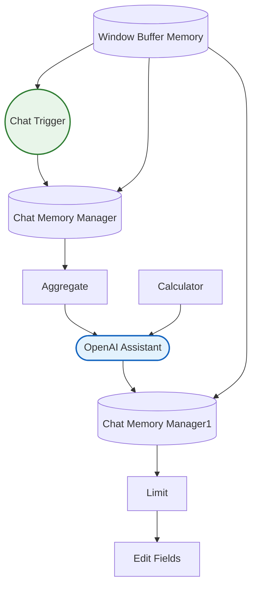

```mermaid
graph TD
    classDef trigger fill:#e8f5e9,stroke:#2e7d32,stroke-width:2px;
    classDef ai fill:#e3f2fd,stroke:#1565c0,stroke-width:2px;
    classDef logic fill:#fff3e0,stroke:#ef6c00,stroke-width:2px;

    OpenAI_Assistant(["OpenAI Assistant"]):::ai
    Calculator["Calculator"]
    Chat_Memory_Manager[("Chat Memory Manager")]
    Chat_Memory_Manager1[("Chat Memory Manager1")]
    Aggregate["Aggregate"]
    Edit_Fields["Edit Fields"]
    Limit["Limit"]
    Chat_Trigger(("Chat Trigger")):::trigger
    Window_Buffer_Memory[("Window Buffer Memory")]

    Limit --> Edit_Fields
    Aggregate --> OpenAI_Assistant
    Calculator --> OpenAI_Assistant
    Chat_Trigger --> Chat_Memory_Manager
    OpenAI_Assistant --> Chat_Memory_Manager1
    Chat_Memory_Manager --> Aggregate
    Chat_Memory_Manager1 --> Limit
    Window_Buffer_Memory --> Chat_Trigger
    Window_Buffer_Memory --> Chat_Memory_Manager
    Window_Buffer_Memory --> Chat_Memory_Manager1
```
