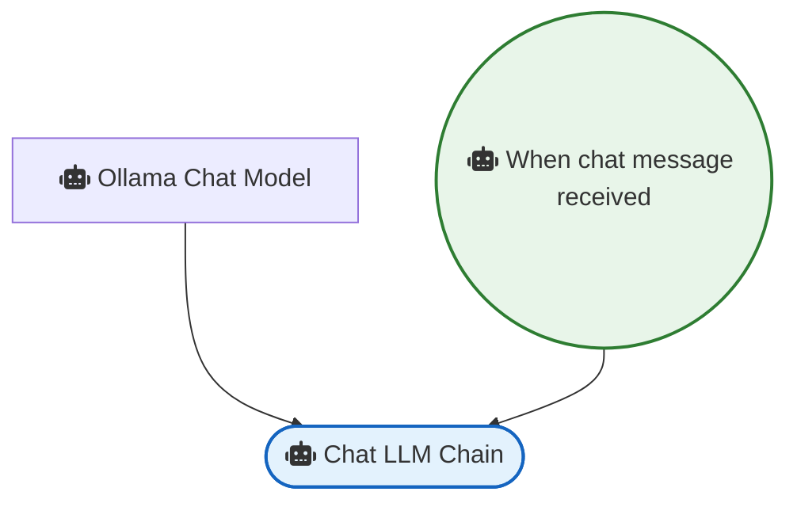

```mermaid
graph TD
    classDef trigger fill:#e8f5e9,stroke:#2e7d32,stroke-width:2px;
    classDef ai fill:#e3f2fd,stroke:#1565c0,stroke-width:2px;
    classDef logic fill:#fff3e0,stroke:#ef6c00,stroke-width:2px;

    When_chat_message_received(("fas:fa-robot When chat message received")):::trigger
    Ollama_Chat_Model["fas:fa-robot Ollama Chat Model"]
    Chat_LLM_Chain(["fas:fa-robot Chat LLM Chain"]):::ai

    Ollama_Chat_Model --> Chat_LLM_Chain
    When_chat_message_received --> Chat_LLM_Chain
```
