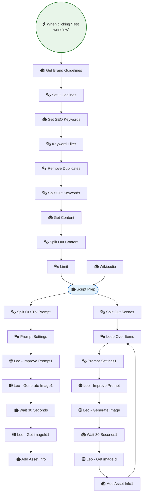

```mermaid
graph TD
    classDef trigger fill:#e8f5e9,stroke:#2e7d32,stroke-width:2px;
    classDef ai fill:#e3f2fd,stroke:#1565c0,stroke-width:2px;
    classDef logic fill:#fff3e0,stroke:#ef6c00,stroke-width:2px;

    When_clicking__Test_workflow_(("fas:fa-bolt When clicking ‘Test workflow’")):::trigger
    Set_Guidelines["fas:fa-cogs Set Guidelines"]
    Get_Brand_Guidelines["fas:fa-robot Get Brand Guidelines"]
    Get_SEO_Keywords["fas:fa-robot Get SEO Keywords"]
    Remove_Duplicates["fas:fa-cogs Remove Duplicates"]
    Keyword_Filter["fas:fa-cogs Keyword Filter"]
    Get_Content["fas:fa-robot Get Content"]
    Split_Out_Content["fas:fa-cogs Split Out Content"]
    Split_Out_Keywords["fas:fa-cogs Split Out Keywords"]
    Limit["fas:fa-cogs Limit"]
    Script_Prep(["fas:fa-robot Script Prep"]):::ai
    Split_Out_Scenes["fas:fa-cogs Split Out Scenes"]
    Split_Out_TN_Prompt["fas:fa-cogs Split Out TN Prompt"]
    Leo___Improve_Prompt1["fas:fa-globe Leo - Improve Prompt1"]
    Leo___Get_imageId1["fas:fa-globe Leo - Get imageId1"]
    Prompt_Settings["fas:fa-cogs Prompt Settings"]
    Leo___Generate_Image1["fas:fa-globe Leo - Generate Image1"]
    Wait_30_Seconds["fas:fa-robot Wait 30 Seconds"]
    Leo___Improve_Prompt["fas:fa-globe Leo - Improve Prompt"]
    Leo___Get_imageId["fas:fa-globe Leo - Get imageId"]
    Prompt_Settings1["fas:fa-cogs Prompt Settings1"]
    Leo___Generate_Image["fas:fa-globe Leo - Generate Image"]
    Wait_30_Seconds1["fas:fa-robot Wait 30 Seconds1"]
    Loop_Over_Items["fas:fa-cogs Loop Over Items"]
    Add_Asset_Info["fas:fa-robot Add Asset Info"]
    Add_Asset_Info1["fas:fa-robot Add Asset Info1"]
    Wikipedia["fas:fa-robot Wikipedia"]

    Limit --> Script_Prep
    Wikipedia --> Script_Prep
    Get_Content --> Split_Out_Content
    Script_Prep --> Split_Out_TN_Prompt
    Script_Prep --> Split_Out_Scenes
    Keyword_Filter --> Remove_Duplicates
    Set_Guidelines --> Get_SEO_Keywords
    Add_Asset_Info1 --> Loop_Over_Items
    Loop_Over_Items --> Prompt_Settings1
    Prompt_Settings --> Leo___Improve_Prompt1
    Wait_30_Seconds --> Leo___Get_imageId1
    Get_SEO_Keywords --> Keyword_Filter
    Prompt_Settings1 --> Leo___Improve_Prompt
    Split_Out_Scenes --> Loop_Over_Items
    Wait_30_Seconds1 --> Leo___Get_imageId
    Leo___Get_imageId --> Add_Asset_Info1
    Remove_Duplicates --> Split_Out_Keywords
    Split_Out_Content --> Limit
    Leo___Get_imageId1 --> Add_Asset_Info
    Split_Out_Keywords --> Get_Content
    Split_Out_TN_Prompt --> Prompt_Settings
    Get_Brand_Guidelines --> Set_Guidelines
    Leo___Generate_Image --> Wait_30_Seconds1
    Leo___Improve_Prompt --> Leo___Generate_Image
    Leo___Generate_Image1 --> Wait_30_Seconds
    Leo___Improve_Prompt1 --> Leo___Generate_Image1
    When_clicking__Test_workflow_ --> Get_Brand_Guidelines
```
