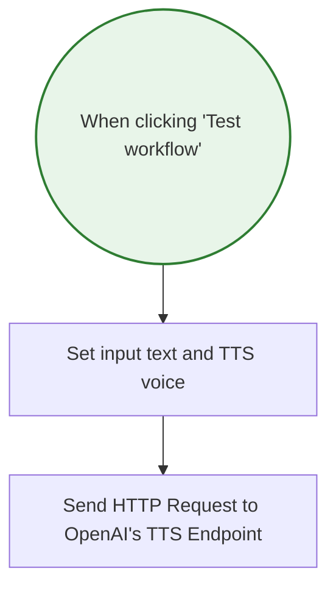

```mermaid
graph TD
    classDef trigger fill:#e8f5e9,stroke:#2e7d32,stroke-width:2px;
    classDef ai fill:#e3f2fd,stroke:#1565c0,stroke-width:2px;
    classDef logic fill:#fff3e0,stroke:#ef6c00,stroke-width:2px;

    When_clicking__Test_workflow_(("When clicking 'Test workflow'")):::trigger
    Set_input_text_and_TTS_voice["Set input text and TTS voice"]
    Send_HTTP_Request_to_OpenAI_s_TTS_Endpoint["Send HTTP Request to OpenAI's TTS Endpoint"]

    Set_input_text_and_TTS_voice --> Send_HTTP_Request_to_OpenAI_s_TTS_Endpoint
    When_clicking__Test_workflow_ --> Set_input_text_and_TTS_voice
```
