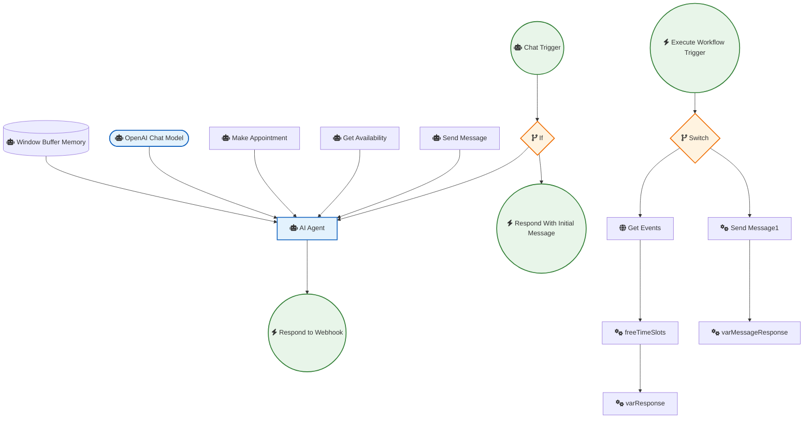

```mermaid
graph TD
    classDef trigger fill:#e8f5e9,stroke:#2e7d32,stroke-width:2px;
    classDef ai fill:#e3f2fd,stroke:#1565c0,stroke-width:2px;
    classDef logic fill:#fff3e0,stroke:#ef6c00,stroke-width:2px;

    Window_Buffer_Memory[("fas:fa-robot Window Buffer Memory")]
    Respond_to_Webhook(("fas:fa-bolt Respond to Webhook")):::trigger
    OpenAI_Chat_Model(["fas:fa-robot OpenAI Chat Model"]):::ai
    Make_Appointment["fas:fa-robot Make Appointment"]
    Execute_Workflow_Trigger(("fas:fa-bolt Execute Workflow Trigger")):::trigger
    varResponse["fas:fa-cogs varResponse"]
    freeTimeSlots["fas:fa-cogs freeTimeSlots"]
    Get_Events["fas:fa-globe Get Events"]
    Get_Availability["fas:fa-robot Get Availability"]
    Send_Message["fas:fa-robot Send Message"]
    Chat_Trigger(("fas:fa-robot Chat Trigger")):::trigger
    Switch{"fas:fa-code-branch Switch"}:::logic
    varMessageResponse["fas:fa-cogs varMessageResponse"]
    Send_Message1["fas:fa-cogs Send Message1"]
    AI_Agent["fas:fa-robot AI Agent"]:::ai
    If{"fas:fa-code-branch If"}:::logic
    Respond_With_Initial_Message(("fas:fa-bolt Respond With Initial Message")):::trigger

    If --> AI_Agent
    If --> Respond_With_Initial_Message
    Switch --> Get_Events
    Switch --> Send_Message1
    AI_Agent --> Respond_to_Webhook
    Get_Events --> freeTimeSlots
    Chat_Trigger --> If
    Send_Message --> AI_Agent
    Send_Message1 --> varMessageResponse
    freeTimeSlots --> varResponse
    Get_Availability --> AI_Agent
    Make_Appointment --> AI_Agent
    OpenAI_Chat_Model --> AI_Agent
    Window_Buffer_Memory --> AI_Agent
    Execute_Workflow_Trigger --> Switch
```
