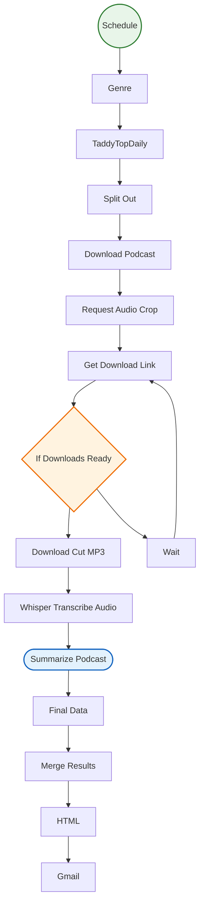

```mermaid
graph TD
    classDef trigger fill:#e8f5e9,stroke:#2e7d32,stroke-width:2px;
    classDef ai fill:#e3f2fd,stroke:#1565c0,stroke-width:2px;
    classDef logic fill:#fff3e0,stroke:#ef6c00,stroke-width:2px;

    Gmail["Gmail"]
    TaddyTopDaily["TaddyTopDaily"]
    Genre["Genre"]
    Split_Out["Split Out"]
    Whisper_Transcribe_Audio["Whisper Transcribe Audio"]
    Final_Data["Final Data"]
    Merge_Results["Merge Results"]
    HTML["HTML"]
    Summarize_Podcast(["Summarize Podcast"]):::ai
    Schedule(("Schedule")):::trigger
    Request_Audio_Crop["Request Audio Crop"]
    Get_Download_Link["Get Download Link"]
    Download_Cut_MP3["Download Cut MP3"]
    Download_Podcast["Download Podcast"]
    Wait["Wait"]
    If_Downloads_Ready{"If Downloads Ready"}:::logic

    HTML --> Gmail
    Wait --> Get_Download_Link
    Genre --> TaddyTopDaily
    Schedule --> Genre
    Split_Out --> Download_Podcast
    Final_Data --> Merge_Results
    Merge_Results --> HTML
    TaddyTopDaily --> Split_Out
    Download_Cut_MP3 --> Whisper_Transcribe_Audio
    Download_Podcast --> Request_Audio_Crop
    Get_Download_Link --> If_Downloads_Ready
    Summarize_Podcast --> Final_Data
    If_Downloads_Ready --> Download_Cut_MP3
    If_Downloads_Ready --> Wait
    Request_Audio_Crop --> Get_Download_Link
    Whisper_Transcribe_Audio --> Summarize_Podcast
```
