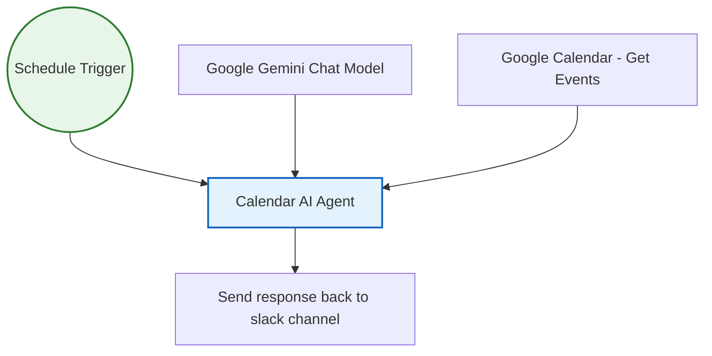

```mermaid
graph TD
    classDef trigger fill:#e8f5e9,stroke:#2e7d32,stroke-width:2px;
    classDef ai fill:#e3f2fd,stroke:#1565c0,stroke-width:2px;
    classDef logic fill:#fff3e0,stroke:#ef6c00,stroke-width:2px;

    Send_response_back_to_slack_channel["Send response back to slack channel"]
    Google_Calendar___Get_Events["Google Calendar - Get Events"]
    Calendar_AI_Agent["Calendar AI Agent"]:::ai
    Schedule_Trigger(("Schedule Trigger")):::trigger
    Google_Gemini_Chat_Model["Google Gemini Chat Model"]

    Schedule_Trigger --> Calendar_AI_Agent
    Calendar_AI_Agent --> Send_response_back_to_slack_channel
    Google_Gemini_Chat_Model --> Calendar_AI_Agent
    Google_Calendar___Get_Events --> Calendar_AI_Agent
```
