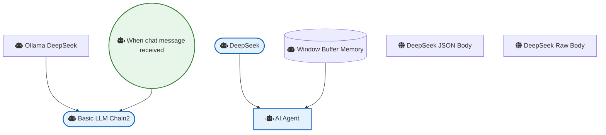

```mermaid
graph TD
    classDef trigger fill:#e8f5e9,stroke:#2e7d32,stroke-width:2px;
    classDef ai fill:#e3f2fd,stroke:#1565c0,stroke-width:2px;
    classDef logic fill:#fff3e0,stroke:#ef6c00,stroke-width:2px;

    When_chat_message_received(("fas:fa-robot When chat message received")):::trigger
    AI_Agent["fas:fa-robot AI Agent"]:::ai
    DeepSeek(["fas:fa-robot DeepSeek"]):::ai
    Window_Buffer_Memory[("fas:fa-robot Window Buffer Memory")]
    Basic_LLM_Chain2(["fas:fa-robot Basic LLM Chain2"]):::ai
    Ollama_DeepSeek["fas:fa-robot Ollama DeepSeek"]
    DeepSeek_JSON_Body["fas:fa-globe DeepSeek JSON Body"]
    DeepSeek_Raw_Body["fas:fa-globe DeepSeek Raw Body"]

    DeepSeek --> AI_Agent
    Ollama_DeepSeek --> Basic_LLM_Chain2
    Window_Buffer_Memory --> AI_Agent
    When_chat_message_received --> Basic_LLM_Chain2
```
