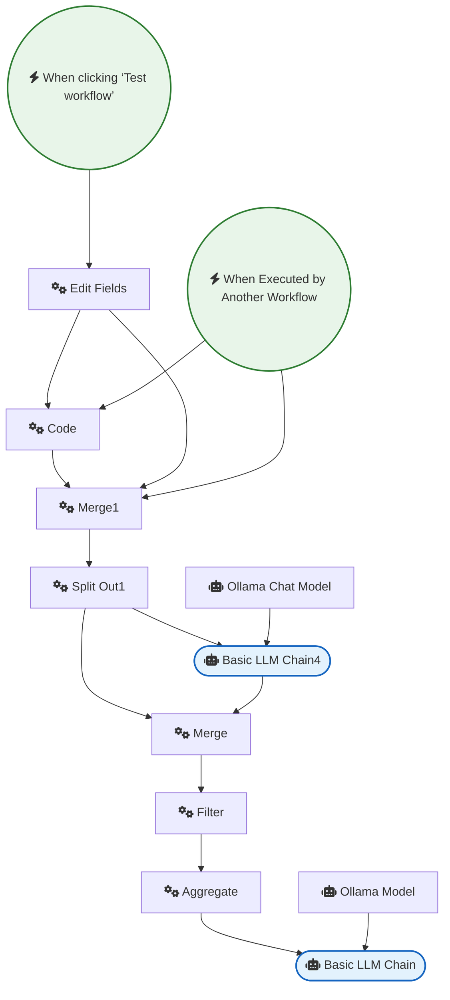

```mermaid
graph TD
    classDef trigger fill:#e8f5e9,stroke:#2e7d32,stroke-width:2px;
    classDef ai fill:#e3f2fd,stroke:#1565c0,stroke-width:2px;
    classDef logic fill:#fff3e0,stroke:#ef6c00,stroke-width:2px;

    Code["fas:fa-cogs Code"]
    Split_Out1["fas:fa-cogs Split Out1"]
    Basic_LLM_Chain4(["fas:fa-robot Basic LLM Chain4"]):::ai
    Ollama_Chat_Model["fas:fa-robot Ollama Chat Model"]
    When_clicking__Test_workflow_(("fas:fa-bolt When clicking ‘Test workflow’")):::trigger
    Edit_Fields["fas:fa-cogs Edit Fields"]
    Merge["fas:fa-cogs Merge"]
    Filter["fas:fa-cogs Filter"]
    When_Executed_by_Another_Workflow(("fas:fa-bolt When Executed by Another Workflow")):::trigger
    Aggregate["fas:fa-cogs Aggregate"]
    Merge1["fas:fa-cogs Merge1"]
    Basic_LLM_Chain(["fas:fa-robot Basic LLM Chain"]):::ai
    Ollama_Model["fas:fa-robot Ollama Model"]

    Code --> Merge1
    Merge --> Filter
    Filter --> Aggregate
    Merge1 --> Split_Out1
    Aggregate --> Basic_LLM_Chain
    Split_Out1 --> Merge
    Split_Out1 --> Basic_LLM_Chain4
    Edit_Fields --> Code
    Edit_Fields --> Merge1
    Ollama_Model --> Basic_LLM_Chain
    Basic_LLM_Chain4 --> Merge
    Ollama_Chat_Model --> Basic_LLM_Chain4
    When_Executed_by_Another_Workflow --> Code
    When_Executed_by_Another_Workflow --> Merge1
    When_clicking__Test_workflow_ --> Edit_Fields
```
