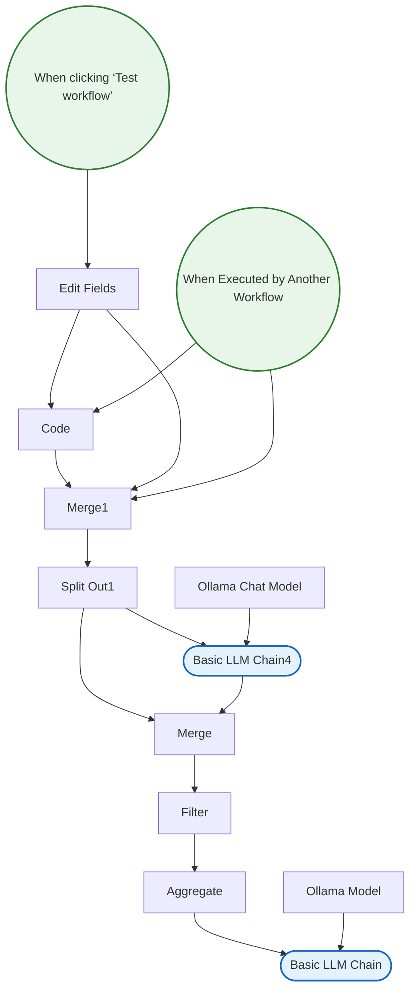

```mermaid
graph TD
    classDef trigger fill:#e8f5e9,stroke:#2e7d32,stroke-width:2px;
    classDef ai fill:#e3f2fd,stroke:#1565c0,stroke-width:2px;
    classDef logic fill:#fff3e0,stroke:#ef6c00,stroke-width:2px;

    Code["Code"]
    Split_Out1["Split Out1"]
    Basic_LLM_Chain4(["Basic LLM Chain4"]):::ai
    Ollama_Chat_Model["Ollama Chat Model"]
    When_clicking__Test_workflow_(("When clicking ‘Test workflow’")):::trigger
    Edit_Fields["Edit Fields"]
    Merge["Merge"]
    Filter["Filter"]
    When_Executed_by_Another_Workflow(("When Executed by Another Workflow")):::trigger
    Aggregate["Aggregate"]
    Merge1["Merge1"]
    Basic_LLM_Chain(["Basic LLM Chain"]):::ai
    Ollama_Model["Ollama Model"]

    Code --> Merge1
    Merge --> Filter
    Filter --> Aggregate
    Merge1 --> Split_Out1
    Aggregate --> Basic_LLM_Chain
    Split_Out1 --> Merge
    Split_Out1 --> Basic_LLM_Chain4
    Edit_Fields --> Code
    Edit_Fields --> Merge1
    Ollama_Model --> Basic_LLM_Chain
    Basic_LLM_Chain4 --> Merge
    Ollama_Chat_Model --> Basic_LLM_Chain4
    When_Executed_by_Another_Workflow --> Code
    When_Executed_by_Another_Workflow --> Merge1
    When_clicking__Test_workflow_ --> Edit_Fields
```
