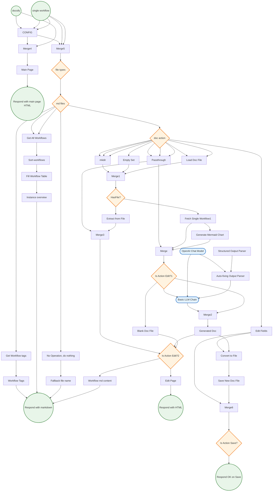

```mermaid
graph TD
    classDef trigger fill:#e8f5e9,stroke:#2e7d32,stroke-width:2px;
    classDef ai fill:#e3f2fd,stroke:#1565c0,stroke-width:2px;
    classDef logic fill:#fff3e0,stroke:#ef6c00,stroke-width:2px;

    CONFIG["CONFIG"]
    Convert_to_File["Convert to File"]
    HasFile_{"HasFile?"}:::logic
    Extract_from_File["Extract from File"]
    Main_Page["Main Page"]
    Instance_overview["Instance overview"]
    Sort_workflows["Sort-workflows"]
    doc_action{"doc action"}:::logic
    Empty_Set["Empty Set"]
    Load_Doc_File["Load Doc File"]
    Respond_with_markdown(("Respond with markdown")):::trigger
    Respond_with_HTML(("Respond with HTML")):::trigger
    Save_New_Doc_File["Save New Doc File"]
    Blank_Doc_File["Blank Doc File"]
    Fetch_Single_Workflow1["Fetch Single Workflow1"]
    Fill_Workflow_Table["Fill Workflow Table"]
    Basic_LLM_Chain(["Basic LLM Chain"]):::ai
    OpenAI_Chat_Model(["OpenAI Chat Model"]):::ai
    Structured_Output_Parser["Structured Output Parser"]
    Auto_fixing_Output_Parser["Auto-fixing Output Parser"]
    Respond_with_main_page_HTML(("Respond with main page HTML")):::trigger
    Workflow_Tags["Workflow Tags"]
    No_Operation__do_nothing["No Operation, do nothing"]
    Merge["Merge"]
    Fallback_file_name["Fallback file name"]
    mkdir["mkdir"]
    Merge1["Merge1"]
    Edit_Page["Edit Page"]
    Workflow_md_content["Workflow md content"]
    Is_Action_Edit_1{"Is Action Edit?1"}:::logic
    Is_Action_Edit_2{"Is Action Edit?2"}:::logic
    Generate_Mermaid_Chart["Generate Mermaid Chart"]
    Merge2["Merge2"]
    Generated_Doc["Generated Doc"]
    Passthrough["Passthrough"]
    Merge3["Merge3"]
    Merge4["Merge4"]
    Merge5["Merge5"]
    Edit_Fields["Edit Fields"]
    Is_Action_Save_{"Is Action Save?"}:::logic
    Merge6["Merge6"]
    Respond_OK_on_Save(("Respond OK on Save")):::trigger
    single_workflow(("single workflow")):::trigger
    file_types{"file types"}:::logic
    Get_All_Workflows["Get All Workflows"]
    md_files{"md files"}:::logic
    Get_Workflow_tags["Get Workflow tags"]
    docsify(("docsify")):::trigger

    Merge --> Is_Action_Edit_1
    mkdir --> Merge1
    CONFIG --> Merge4
    CONFIG --> Merge5
    Merge1 --> HasFile_
    Merge2 --> Generated_Doc
    Merge3 --> Is_Action_Edit_2
    Merge4 --> Main_Page
    Merge5 --> file_types
    Merge6 --> Is_Action_Save_
    docsify --> CONFIG
    docsify --> Merge4
    HasFile_ --> Extract_from_File
    HasFile_ --> Fetch_Single_Workflow1
    md_files --> Get_All_Workflows
    md_files --> doc_action
    md_files --> Get_Workflow_tags
    md_files --> Get_All_Workflows
    md_files --> No_Operation__do_nothing
    Edit_Page --> Respond_with_HTML
    Empty_Set --> Merge1
    Main_Page --> Respond_with_main_page_HTML
    doc_action --> mkdir
    doc_action --> Load_Doc_File
    doc_action --> Passthrough
    doc_action --> mkdir
    doc_action --> Load_Doc_File
    doc_action --> Passthrough
    doc_action --> mkdir
    doc_action --> Empty_Set
    doc_action --> Passthrough
    doc_action --> Edit_Fields
    file_types --> md_files
    Edit_Fields --> Convert_to_File
    Edit_Fields --> Merge6
    Passthrough --> Merge3
    Passthrough --> Merge
    Generated_Doc --> Convert_to_File
    Generated_Doc --> Is_Action_Edit_2
    Load_Doc_File --> Merge1
    Workflow_Tags --> Respond_with_markdown
    Blank_Doc_File --> Is_Action_Edit_2
    Sort_workflows --> Fill_Workflow_Table
    Basic_LLM_Chain --> Merge2
    Convert_to_File --> Save_New_Doc_File
    Is_Action_Save_ --> Respond_OK_on_Save
    single_workflow --> CONFIG
    single_workflow --> Merge5
    single_workflow --> CONFIG
    single_workflow --> Merge5
    Is_Action_Edit_1 --> Blank_Doc_File
    Is_Action_Edit_1 --> Basic_LLM_Chain
    Is_Action_Edit_1 --> Merge2
    Is_Action_Edit_2 --> Edit_Page
    Is_Action_Edit_2 --> Workflow_md_content
    Extract_from_File --> Merge3
    Get_All_Workflows --> Sort_workflows
    Get_Workflow_tags --> Workflow_Tags
    Instance_overview --> Respond_with_markdown
    OpenAI_Chat_Model --> Basic_LLM_Chain
    OpenAI_Chat_Model --> Auto_fixing_Output_Parser
    Save_New_Doc_File --> Merge6
    Fallback_file_name --> Respond_with_markdown
    Fill_Workflow_Table --> Instance_overview
    Workflow_md_content --> Respond_with_markdown
    Fetch_Single_Workflow1 --> Generate_Mermaid_Chart
    Fetch_Single_Workflow1 --> Merge
    Generate_Mermaid_Chart --> Merge
    No_Operation__do_nothing --> Fallback_file_name
    Structured_Output_Parser --> Auto_fixing_Output_Parser
    Auto_fixing_Output_Parser --> Basic_LLM_Chain
```
