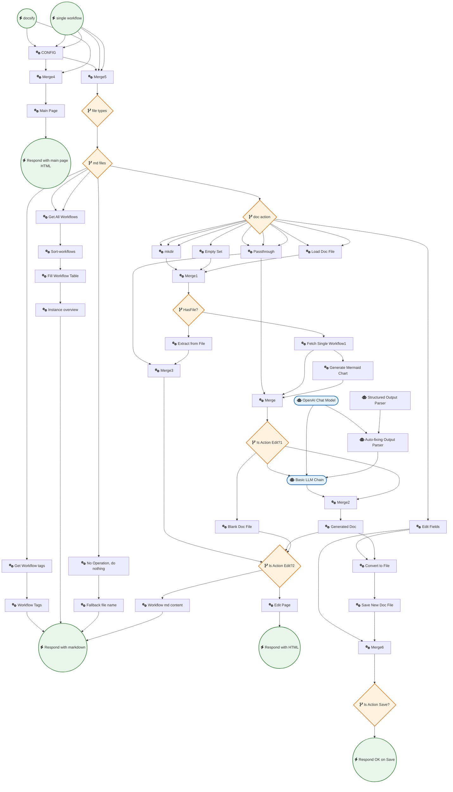

```mermaid
graph TD
    classDef trigger fill:#e8f5e9,stroke:#2e7d32,stroke-width:2px;
    classDef ai fill:#e3f2fd,stroke:#1565c0,stroke-width:2px;
    classDef logic fill:#fff3e0,stroke:#ef6c00,stroke-width:2px;

    CONFIG["fas:fa-cogs CONFIG"]
    Convert_to_File["fas:fa-cogs Convert to File"]
    HasFile_{"fas:fa-code-branch HasFile?"}:::logic
    Extract_from_File["fas:fa-cogs Extract from File"]
    Main_Page["fas:fa-cogs Main Page"]
    Instance_overview["fas:fa-cogs Instance overview"]
    Sort_workflows["fas:fa-cogs Sort-workflows"]
    doc_action{"fas:fa-code-branch doc action"}:::logic
    Empty_Set["fas:fa-cogs Empty Set"]
    Load_Doc_File["fas:fa-cogs Load Doc File"]
    Respond_with_markdown(("fas:fa-bolt Respond with markdown")):::trigger
    Respond_with_HTML(("fas:fa-bolt Respond with HTML")):::trigger
    Save_New_Doc_File["fas:fa-cogs Save New Doc File"]
    Blank_Doc_File["fas:fa-cogs Blank Doc File"]
    Fetch_Single_Workflow1["fas:fa-cogs Fetch Single Workflow1"]
    Fill_Workflow_Table["fas:fa-cogs Fill Workflow Table"]
    Basic_LLM_Chain(["fas:fa-robot Basic LLM Chain"]):::ai
    OpenAI_Chat_Model(["fas:fa-robot OpenAI Chat Model"]):::ai
    Structured_Output_Parser["fas:fa-robot Structured Output Parser"]
    Auto_fixing_Output_Parser["fas:fa-robot Auto-fixing Output Parser"]
    Respond_with_main_page_HTML(("fas:fa-bolt Respond with main page HTML")):::trigger
    Workflow_Tags["fas:fa-cogs Workflow Tags"]
    No_Operation__do_nothing["fas:fa-cogs No Operation, do nothing"]
    Merge["fas:fa-cogs Merge"]
    Fallback_file_name["fas:fa-cogs Fallback file name"]
    mkdir["fas:fa-cogs mkdir"]
    Merge1["fas:fa-cogs Merge1"]
    Edit_Page["fas:fa-cogs Edit Page"]
    Workflow_md_content["fas:fa-cogs Workflow md content"]
    Is_Action_Edit_1{"fas:fa-code-branch Is Action Edit?1"}:::logic
    Is_Action_Edit_2{"fas:fa-code-branch Is Action Edit?2"}:::logic
    Generate_Mermaid_Chart["fas:fa-cogs Generate Mermaid Chart"]
    Merge2["fas:fa-cogs Merge2"]
    Generated_Doc["fas:fa-cogs Generated Doc"]
    Passthrough["fas:fa-cogs Passthrough"]
    Merge3["fas:fa-cogs Merge3"]
    Merge4["fas:fa-cogs Merge4"]
    Merge5["fas:fa-cogs Merge5"]
    Edit_Fields["fas:fa-cogs Edit Fields"]
    Is_Action_Save_{"fas:fa-code-branch Is Action Save?"}:::logic
    Merge6["fas:fa-cogs Merge6"]
    Respond_OK_on_Save(("fas:fa-bolt Respond OK on Save")):::trigger
    single_workflow(("fas:fa-bolt single workflow")):::trigger
    file_types{"fas:fa-code-branch file types"}:::logic
    Get_All_Workflows["fas:fa-cogs Get All Workflows"]
    md_files{"fas:fa-code-branch md files"}:::logic
    Get_Workflow_tags["fas:fa-cogs Get Workflow tags"]
    docsify(("fas:fa-bolt docsify")):::trigger

    Merge --> Is_Action_Edit_1
    mkdir --> Merge1
    CONFIG --> Merge4
    CONFIG --> Merge5
    Merge1 --> HasFile_
    Merge2 --> Generated_Doc
    Merge3 --> Is_Action_Edit_2
    Merge4 --> Main_Page
    Merge5 --> file_types
    Merge6 --> Is_Action_Save_
    docsify --> CONFIG
    docsify --> Merge4
    HasFile_ --> Extract_from_File
    HasFile_ --> Fetch_Single_Workflow1
    md_files --> Get_All_Workflows
    md_files --> doc_action
    md_files --> Get_Workflow_tags
    md_files --> Get_All_Workflows
    md_files --> No_Operation__do_nothing
    Edit_Page --> Respond_with_HTML
    Empty_Set --> Merge1
    Main_Page --> Respond_with_main_page_HTML
    doc_action --> mkdir
    doc_action --> Load_Doc_File
    doc_action --> Passthrough
    doc_action --> mkdir
    doc_action --> Load_Doc_File
    doc_action --> Passthrough
    doc_action --> mkdir
    doc_action --> Empty_Set
    doc_action --> Passthrough
    doc_action --> Edit_Fields
    file_types --> md_files
    Edit_Fields --> Convert_to_File
    Edit_Fields --> Merge6
    Passthrough --> Merge3
    Passthrough --> Merge
    Generated_Doc --> Convert_to_File
    Generated_Doc --> Is_Action_Edit_2
    Load_Doc_File --> Merge1
    Workflow_Tags --> Respond_with_markdown
    Blank_Doc_File --> Is_Action_Edit_2
    Sort_workflows --> Fill_Workflow_Table
    Basic_LLM_Chain --> Merge2
    Convert_to_File --> Save_New_Doc_File
    Is_Action_Save_ --> Respond_OK_on_Save
    single_workflow --> CONFIG
    single_workflow --> Merge5
    single_workflow --> CONFIG
    single_workflow --> Merge5
    Is_Action_Edit_1 --> Blank_Doc_File
    Is_Action_Edit_1 --> Basic_LLM_Chain
    Is_Action_Edit_1 --> Merge2
    Is_Action_Edit_2 --> Edit_Page
    Is_Action_Edit_2 --> Workflow_md_content
    Extract_from_File --> Merge3
    Get_All_Workflows --> Sort_workflows
    Get_Workflow_tags --> Workflow_Tags
    Instance_overview --> Respond_with_markdown
    OpenAI_Chat_Model --> Basic_LLM_Chain
    OpenAI_Chat_Model --> Auto_fixing_Output_Parser
    Save_New_Doc_File --> Merge6
    Fallback_file_name --> Respond_with_markdown
    Fill_Workflow_Table --> Instance_overview
    Workflow_md_content --> Respond_with_markdown
    Fetch_Single_Workflow1 --> Generate_Mermaid_Chart
    Fetch_Single_Workflow1 --> Merge
    Generate_Mermaid_Chart --> Merge
    No_Operation__do_nothing --> Fallback_file_name
    Structured_Output_Parser --> Auto_fixing_Output_Parser
    Auto_fixing_Output_Parser --> Basic_LLM_Chain
```
