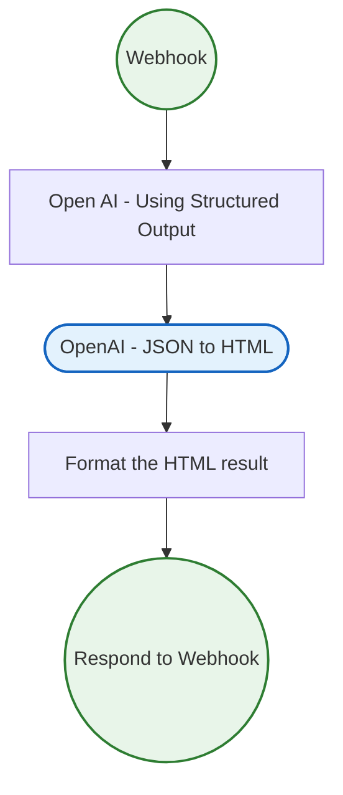

```mermaid
graph TD
    classDef trigger fill:#e8f5e9,stroke:#2e7d32,stroke-width:2px;
    classDef ai fill:#e3f2fd,stroke:#1565c0,stroke-width:2px;
    classDef logic fill:#fff3e0,stroke:#ef6c00,stroke-width:2px;

    Respond_to_Webhook(("Respond to Webhook")):::trigger
    Open_AI___Using_Structured_Output["Open AI - Using Structured Output"]
    OpenAI___JSON_to_HTML(["OpenAI - JSON to HTML"]):::ai
    Format_the_HTML_result["Format the HTML result"]
    Webhook(("Webhook")):::trigger

    Webhook --> Open_AI___Using_Structured_Output
    OpenAI___JSON_to_HTML --> Format_the_HTML_result
    Format_the_HTML_result --> Respond_to_Webhook
    Open_AI___Using_Structured_Output --> OpenAI___JSON_to_HTML
```
