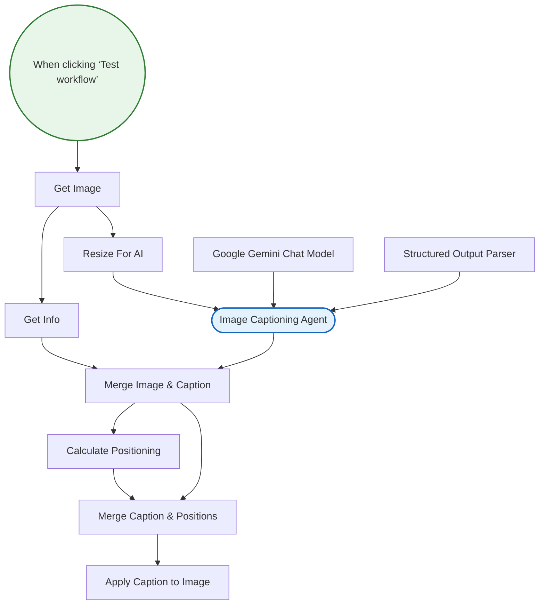

```mermaid
graph TD
    classDef trigger fill:#e8f5e9,stroke:#2e7d32,stroke-width:2px;
    classDef ai fill:#e3f2fd,stroke:#1565c0,stroke-width:2px;
    classDef logic fill:#fff3e0,stroke:#ef6c00,stroke-width:2px;

    When_clicking__Test_workflow_(("When clicking ‘Test workflow’")):::trigger
    Google_Gemini_Chat_Model["Google Gemini Chat Model"]
    Structured_Output_Parser["Structured Output Parser"]
    Get_Info["Get Info"]
    Resize_For_AI["Resize For AI"]
    Calculate_Positioning["Calculate Positioning"]
    Apply_Caption_to_Image["Apply Caption to Image"]
    Merge_Image___Caption["Merge Image & Caption"]
    Merge_Caption___Positions["Merge Caption & Positions"]
    Get_Image["Get Image"]
    Image_Captioning_Agent(["Image Captioning Agent"]):::ai

    Get_Info --> Merge_Image___Caption
    Get_Image --> Resize_For_AI
    Get_Image --> Get_Info
    Resize_For_AI --> Image_Captioning_Agent
    Calculate_Positioning --> Merge_Caption___Positions
    Merge_Image___Caption --> Calculate_Positioning
    Merge_Image___Caption --> Merge_Caption___Positions
    Image_Captioning_Agent --> Merge_Image___Caption
    Google_Gemini_Chat_Model --> Image_Captioning_Agent
    Structured_Output_Parser --> Image_Captioning_Agent
    Merge_Caption___Positions --> Apply_Caption_to_Image
    When_clicking__Test_workflow_ --> Get_Image
```
