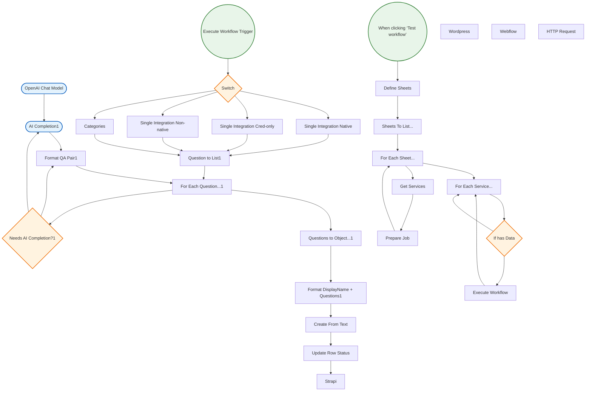

```mermaid
graph TD
    classDef trigger fill:#e8f5e9,stroke:#2e7d32,stroke-width:2px;
    classDef ai fill:#e3f2fd,stroke:#1565c0,stroke-width:2px;
    classDef logic fill:#fff3e0,stroke:#ef6c00,stroke-width:2px;

    When_clicking__Test_workflow_(("When clicking ‘Test workflow’")):::trigger
    OpenAI_Chat_Model(["OpenAI Chat Model"]):::ai
    Format_QA_Pair1["Format QA Pair1"]
    For_Each_Question___1["For Each Question...1"]
    Question_to_List1["Question to List1"]
    Questions_to_Object___1["Questions to Object...1"]
    Format_DisplayName___Questions1["Format DisplayName + Questions1"]
    Create_From_Text["Create From Text"]
    Define_Sheets["Define Sheets"]
    Sheets_To_List___["Sheets To List..."]
    Get_Services["Get Services"]
    Single_Integration_Cred_only["Single Integration Cred-only"]
    Single_Integration_Native["Single Integration Native"]
    Categories["Categories"]
    For_Each_Sheet___["For Each Sheet..."]
    Execute_Workflow_Trigger(("Execute Workflow Trigger")):::trigger
    Execute_Workflow["Execute Workflow"]
    Prepare_Job["Prepare Job"]
    For_Each_Service___["For Each Service..."]
    Update_Row_Status["Update Row Status"]
    Single_Integration_Non_native["Single Integration Non-native"]
    If_has_Data{"If has Data"}:::logic
    Needs_AI_Completion_1{"Needs AI Completion?1"}:::logic
    Switch{"Switch"}:::logic
    Strapi["Strapi"]
    Wordpress["Wordpress"]
    Webflow["Webflow"]
    HTTP_Request["HTTP Request"]
    AI_Completion1(["AI Completion1"]):::ai

    Switch --> Single_Integration_Native
    Switch --> Single_Integration_Cred_only
    Switch --> Single_Integration_Non_native
    Switch --> Categories
    Categories --> Question_to_List1
    If_has_Data --> Execute_Workflow
    If_has_Data --> For_Each_Service___
    Prepare_Job --> For_Each_Sheet___
    Get_Services --> Prepare_Job
    Define_Sheets --> Sheets_To_List___
    AI_Completion1 --> Format_QA_Pair1
    Format_QA_Pair1 --> For_Each_Question___1
    Create_From_Text --> Update_Row_Status
    Execute_Workflow --> For_Each_Service___
    For_Each_Sheet___ --> For_Each_Service___
    For_Each_Sheet___ --> Get_Services
    OpenAI_Chat_Model --> AI_Completion1
    Question_to_List1 --> For_Each_Question___1
    Sheets_To_List___ --> For_Each_Sheet___
    Update_Row_Status --> Strapi
    For_Each_Service___ --> If_has_Data
    For_Each_Question___1 --> Questions_to_Object___1
    For_Each_Question___1 --> Needs_AI_Completion_1
    Needs_AI_Completion_1 --> Format_QA_Pair1
    Needs_AI_Completion_1 --> AI_Completion1
    Questions_to_Object___1 --> Format_DisplayName___Questions1
    Execute_Workflow_Trigger --> Switch
    Single_Integration_Native --> Question_to_List1
    Single_Integration_Cred_only --> Question_to_List1
    Single_Integration_Non_native --> Question_to_List1
    Format_DisplayName___Questions1 --> Create_From_Text
    When_clicking__Test_workflow_ --> Define_Sheets
```
