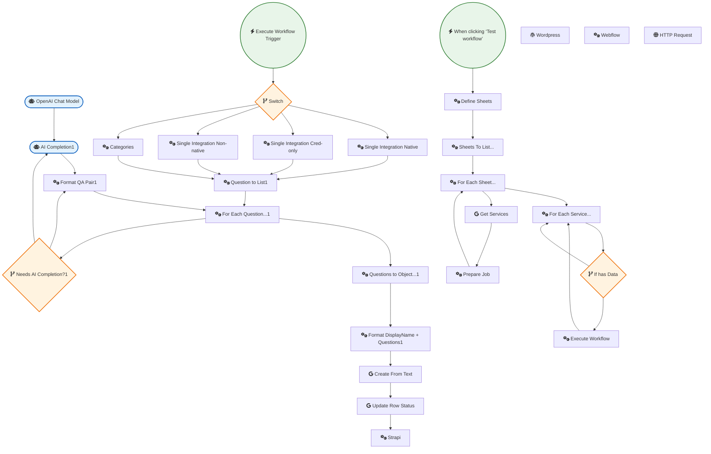

```mermaid
graph TD
    classDef trigger fill:#e8f5e9,stroke:#2e7d32,stroke-width:2px;
    classDef ai fill:#e3f2fd,stroke:#1565c0,stroke-width:2px;
    classDef logic fill:#fff3e0,stroke:#ef6c00,stroke-width:2px;

    When_clicking__Test_workflow_(("fas:fa-bolt When clicking ‘Test workflow’")):::trigger
    OpenAI_Chat_Model(["fas:fa-robot OpenAI Chat Model"]):::ai
    Format_QA_Pair1["fas:fa-cogs Format QA Pair1"]
    For_Each_Question___1["fas:fa-cogs For Each Question...1"]
    Question_to_List1["fas:fa-cogs Question to List1"]
    Questions_to_Object___1["fas:fa-cogs Questions to Object...1"]
    Format_DisplayName___Questions1["fas:fa-cogs Format DisplayName + Questions1"]
    Create_From_Text["fab:fa-google Create From Text"]
    Define_Sheets["fas:fa-cogs Define Sheets"]
    Sheets_To_List___["fas:fa-cogs Sheets To List..."]
    Get_Services["fab:fa-google Get Services"]
    Single_Integration_Cred_only["fas:fa-cogs Single Integration Cred-only"]
    Single_Integration_Native["fas:fa-cogs Single Integration Native"]
    Categories["fas:fa-cogs Categories"]
    For_Each_Sheet___["fas:fa-cogs For Each Sheet..."]
    Execute_Workflow_Trigger(("fas:fa-bolt Execute Workflow Trigger")):::trigger
    Execute_Workflow["fas:fa-cogs Execute Workflow"]
    Prepare_Job["fas:fa-cogs Prepare Job"]
    For_Each_Service___["fas:fa-cogs For Each Service..."]
    Update_Row_Status["fab:fa-google Update Row Status"]
    Single_Integration_Non_native["fas:fa-cogs Single Integration Non-native"]
    If_has_Data{"fas:fa-code-branch If has Data"}:::logic
    Needs_AI_Completion_1{"fas:fa-code-branch Needs AI Completion?1"}:::logic
    Switch{"fas:fa-code-branch Switch"}:::logic
    Strapi["fas:fa-cogs Strapi"]
    Wordpress["fab:fa-wordpress Wordpress"]
    Webflow["fas:fa-cogs Webflow"]
    HTTP_Request["fas:fa-globe HTTP Request"]
    AI_Completion1(["fas:fa-robot AI Completion1"]):::ai

    Switch --> Single_Integration_Native
    Switch --> Single_Integration_Cred_only
    Switch --> Single_Integration_Non_native
    Switch --> Categories
    Categories --> Question_to_List1
    If_has_Data --> Execute_Workflow
    If_has_Data --> For_Each_Service___
    Prepare_Job --> For_Each_Sheet___
    Get_Services --> Prepare_Job
    Define_Sheets --> Sheets_To_List___
    AI_Completion1 --> Format_QA_Pair1
    Format_QA_Pair1 --> For_Each_Question___1
    Create_From_Text --> Update_Row_Status
    Execute_Workflow --> For_Each_Service___
    For_Each_Sheet___ --> For_Each_Service___
    For_Each_Sheet___ --> Get_Services
    OpenAI_Chat_Model --> AI_Completion1
    Question_to_List1 --> For_Each_Question___1
    Sheets_To_List___ --> For_Each_Sheet___
    Update_Row_Status --> Strapi
    For_Each_Service___ --> If_has_Data
    For_Each_Question___1 --> Questions_to_Object___1
    For_Each_Question___1 --> Needs_AI_Completion_1
    Needs_AI_Completion_1 --> Format_QA_Pair1
    Needs_AI_Completion_1 --> AI_Completion1
    Questions_to_Object___1 --> Format_DisplayName___Questions1
    Execute_Workflow_Trigger --> Switch
    Single_Integration_Native --> Question_to_List1
    Single_Integration_Cred_only --> Question_to_List1
    Single_Integration_Non_native --> Question_to_List1
    Format_DisplayName___Questions1 --> Create_From_Text
    When_clicking__Test_workflow_ --> Define_Sheets
```
