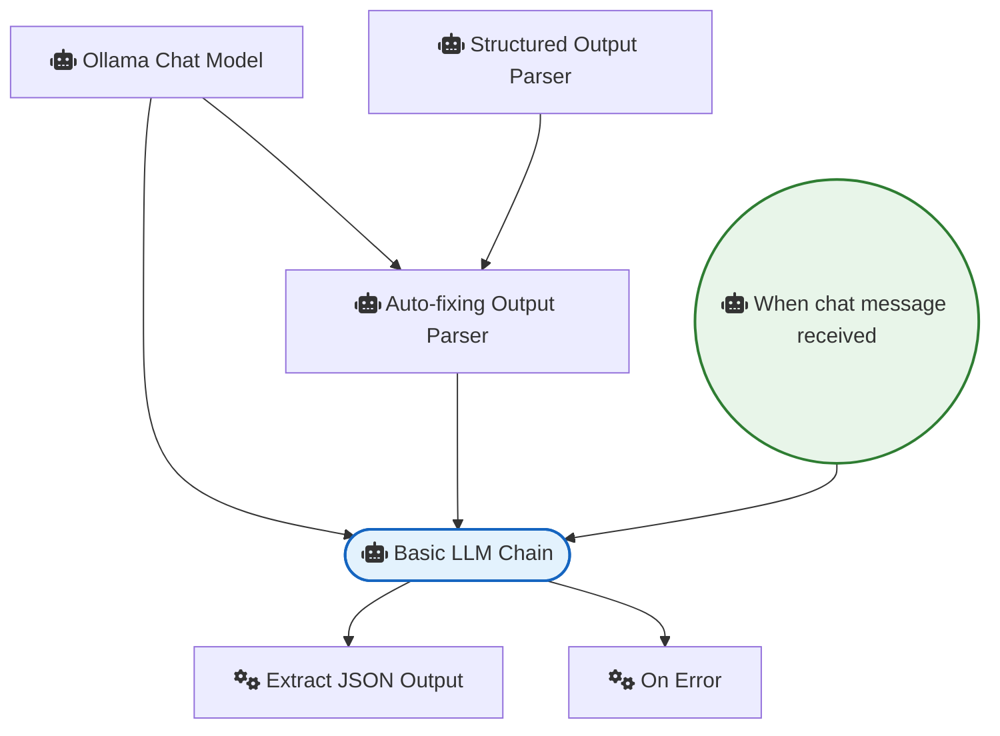

```mermaid
graph TD
    classDef trigger fill:#e8f5e9,stroke:#2e7d32,stroke-width:2px;
    classDef ai fill:#e3f2fd,stroke:#1565c0,stroke-width:2px;
    classDef logic fill:#fff3e0,stroke:#ef6c00,stroke-width:2px;

    When_chat_message_received(("fas:fa-robot When chat message received")):::trigger
    Ollama_Chat_Model["fas:fa-robot Ollama Chat Model"]
    Auto_fixing_Output_Parser["fas:fa-robot Auto-fixing Output Parser"]
    Structured_Output_Parser["fas:fa-robot Structured Output Parser"]
    Basic_LLM_Chain(["fas:fa-robot Basic LLM Chain"]):::ai
    On_Error["fas:fa-cogs On Error"]
    Extract_JSON_Output["fas:fa-cogs Extract JSON Output"]

    Basic_LLM_Chain --> Extract_JSON_Output
    Basic_LLM_Chain --> On_Error
    Ollama_Chat_Model --> Auto_fixing_Output_Parser
    Ollama_Chat_Model --> Basic_LLM_Chain
    Structured_Output_Parser --> Auto_fixing_Output_Parser
    Auto_fixing_Output_Parser --> Basic_LLM_Chain
    When_chat_message_received --> Basic_LLM_Chain
```
