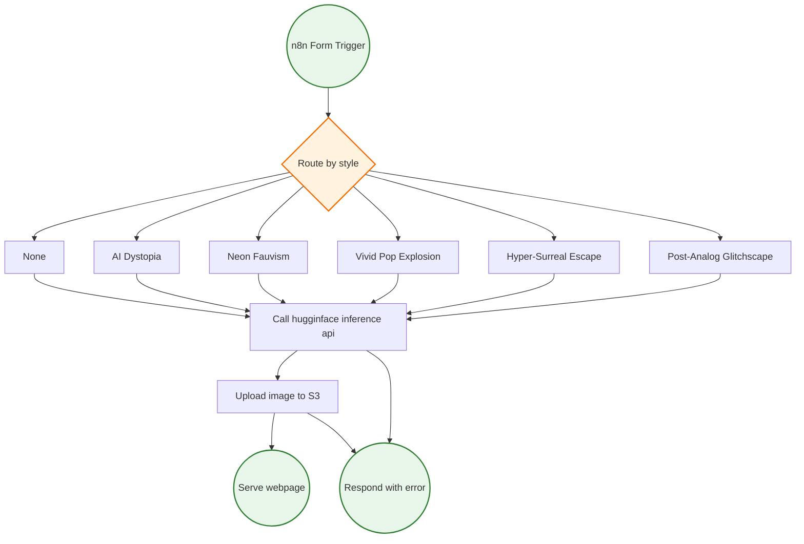

```mermaid
graph TD
    classDef trigger fill:#e8f5e9,stroke:#2e7d32,stroke-width:2px;
    classDef ai fill:#e3f2fd,stroke:#1565c0,stroke-width:2px;
    classDef logic fill:#fff3e0,stroke:#ef6c00,stroke-width:2px;

    Vivid_Pop_Explosion["Vivid Pop Explosion"]
    AI_Dystopia["AI Dystopia"]
    Post_Analog_Glitchscape["Post-Analog Glitchscape"]
    Neon_Fauvism["Neon Fauvism"]
    None["None"]
    Serve_webpage(("Serve webpage")):::trigger
    Respond_with_error(("Respond with error")):::trigger
    Upload_image_to_S3["Upload image to S3"]
    Hyper_Surreal_Escape["Hyper-Surreal Escape"]
    n8n_Form_Trigger(("n8n Form Trigger")):::trigger
    Call_hugginface_inference_api["Call hugginface inference api"]
    Route_by_style{"Route by style"}:::logic

    None --> Call_hugginface_inference_api
    AI_Dystopia --> Call_hugginface_inference_api
    Neon_Fauvism --> Call_hugginface_inference_api
    Route_by_style --> Hyper_Surreal_Escape
    Route_by_style --> Post_Analog_Glitchscape
    Route_by_style --> AI_Dystopia
    Route_by_style --> Neon_Fauvism
    Route_by_style --> Vivid_Pop_Explosion
    Route_by_style --> None
    n8n_Form_Trigger --> Route_by_style
    Upload_image_to_S3 --> Serve_webpage
    Upload_image_to_S3 --> Respond_with_error
    Vivid_Pop_Explosion --> Call_hugginface_inference_api
    Hyper_Surreal_Escape --> Call_hugginface_inference_api
    Post_Analog_Glitchscape --> Call_hugginface_inference_api
    Call_hugginface_inference_api --> Upload_image_to_S3
    Call_hugginface_inference_api --> Respond_with_error
```
