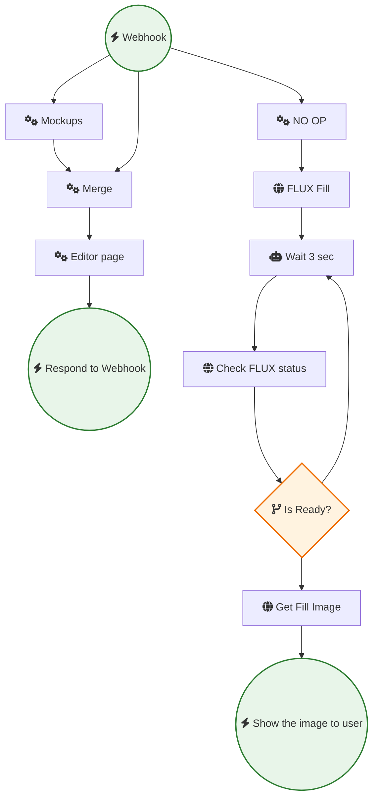

```mermaid
graph TD
    classDef trigger fill:#e8f5e9,stroke:#2e7d32,stroke-width:2px;
    classDef ai fill:#e3f2fd,stroke:#1565c0,stroke-width:2px;
    classDef logic fill:#fff3e0,stroke:#ef6c00,stroke-width:2px;

    Merge["fas:fa-cogs Merge"]
    Respond_to_Webhook(("fas:fa-bolt Respond to Webhook")):::trigger
    Wait_3_sec["fas:fa-robot Wait 3 sec"]
    Is_Ready_{"fas:fa-code-branch Is Ready?"}:::logic
    FLUX_Fill["fas:fa-globe FLUX Fill"]
    Check_FLUX_status["fas:fa-globe Check FLUX status"]
    Get_Fill_Image["fas:fa-globe Get Fill Image"]
    Show_the_image_to_user(("fas:fa-bolt Show the image to user")):::trigger
    Mockups["fas:fa-cogs Mockups"]
    Webhook(("fas:fa-bolt Webhook")):::trigger
    Editor_page["fas:fa-cogs Editor page"]
    NO_OP["fas:fa-cogs NO OP"]

    Merge --> Editor_page
    NO_OP --> FLUX_Fill
    Mockups --> Merge
    Webhook --> Merge
    Webhook --> Mockups
    Webhook --> NO_OP
    FLUX_Fill --> Wait_3_sec
    Is_Ready_ --> Get_Fill_Image
    Is_Ready_ --> Wait_3_sec
    Wait_3_sec --> Check_FLUX_status
    Editor_page --> Respond_to_Webhook
    Get_Fill_Image --> Show_the_image_to_user
    Check_FLUX_status --> Is_Ready_
```
