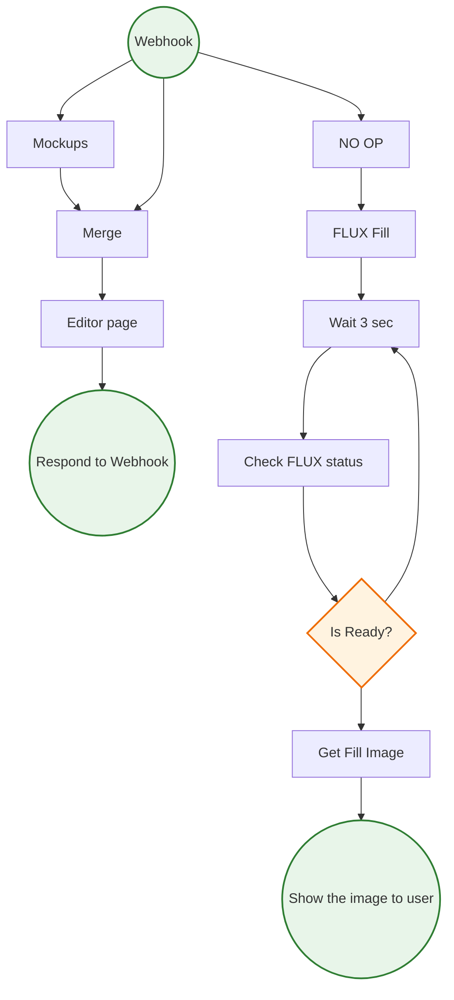

```mermaid
graph TD
    classDef trigger fill:#e8f5e9,stroke:#2e7d32,stroke-width:2px;
    classDef ai fill:#e3f2fd,stroke:#1565c0,stroke-width:2px;
    classDef logic fill:#fff3e0,stroke:#ef6c00,stroke-width:2px;

    Merge["Merge"]
    Respond_to_Webhook(("Respond to Webhook")):::trigger
    Wait_3_sec["Wait 3 sec"]
    Is_Ready_{"Is Ready?"}:::logic
    FLUX_Fill["FLUX Fill"]
    Check_FLUX_status["Check FLUX status"]
    Get_Fill_Image["Get Fill Image"]
    Show_the_image_to_user(("Show the image to user")):::trigger
    Mockups["Mockups"]
    Webhook(("Webhook")):::trigger
    Editor_page["Editor page"]
    NO_OP["NO OP"]

    Merge --> Editor_page
    NO_OP --> FLUX_Fill
    Mockups --> Merge
    Webhook --> Merge
    Webhook --> Mockups
    Webhook --> NO_OP
    FLUX_Fill --> Wait_3_sec
    Is_Ready_ --> Get_Fill_Image
    Is_Ready_ --> Wait_3_sec
    Wait_3_sec --> Check_FLUX_status
    Editor_page --> Respond_to_Webhook
    Get_Fill_Image --> Show_the_image_to_user
    Check_FLUX_status --> Is_Ready_
```
