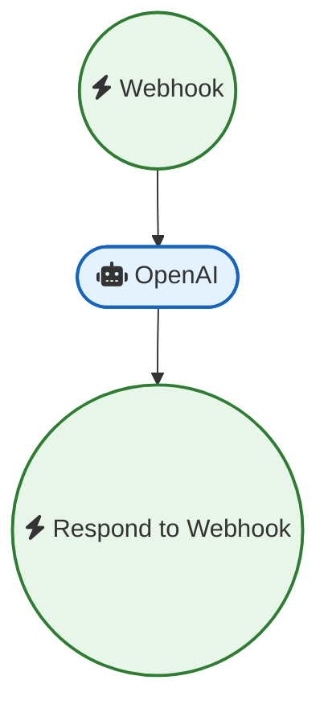

```mermaid
graph TD
    classDef trigger fill:#e8f5e9,stroke:#2e7d32,stroke-width:2px;
    classDef ai fill:#e3f2fd,stroke:#1565c0,stroke-width:2px;
    classDef logic fill:#fff3e0,stroke:#ef6c00,stroke-width:2px;

    Respond_to_Webhook(("fas:fa-bolt Respond to Webhook")):::trigger
    Webhook(("fas:fa-bolt Webhook")):::trigger
    OpenAI(["fas:fa-robot OpenAI"]):::ai

    OpenAI --> Respond_to_Webhook
    Webhook --> OpenAI
```
