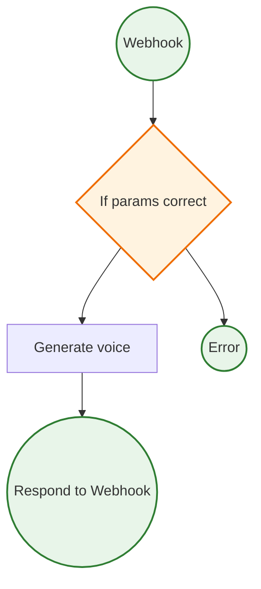

```mermaid
graph TD
    classDef trigger fill:#e8f5e9,stroke:#2e7d32,stroke-width:2px;
    classDef ai fill:#e3f2fd,stroke:#1565c0,stroke-width:2px;
    classDef logic fill:#fff3e0,stroke:#ef6c00,stroke-width:2px;

    If_params_correct{"If params correct"}:::logic
    Respond_to_Webhook(("Respond to Webhook")):::trigger
    Webhook(("Webhook")):::trigger
    Generate_voice["Generate voice"]
    Error(("Error")):::trigger

    Webhook --> If_params_correct
    Generate_voice --> Respond_to_Webhook
    If_params_correct --> Generate_voice
    If_params_correct --> Error
```
