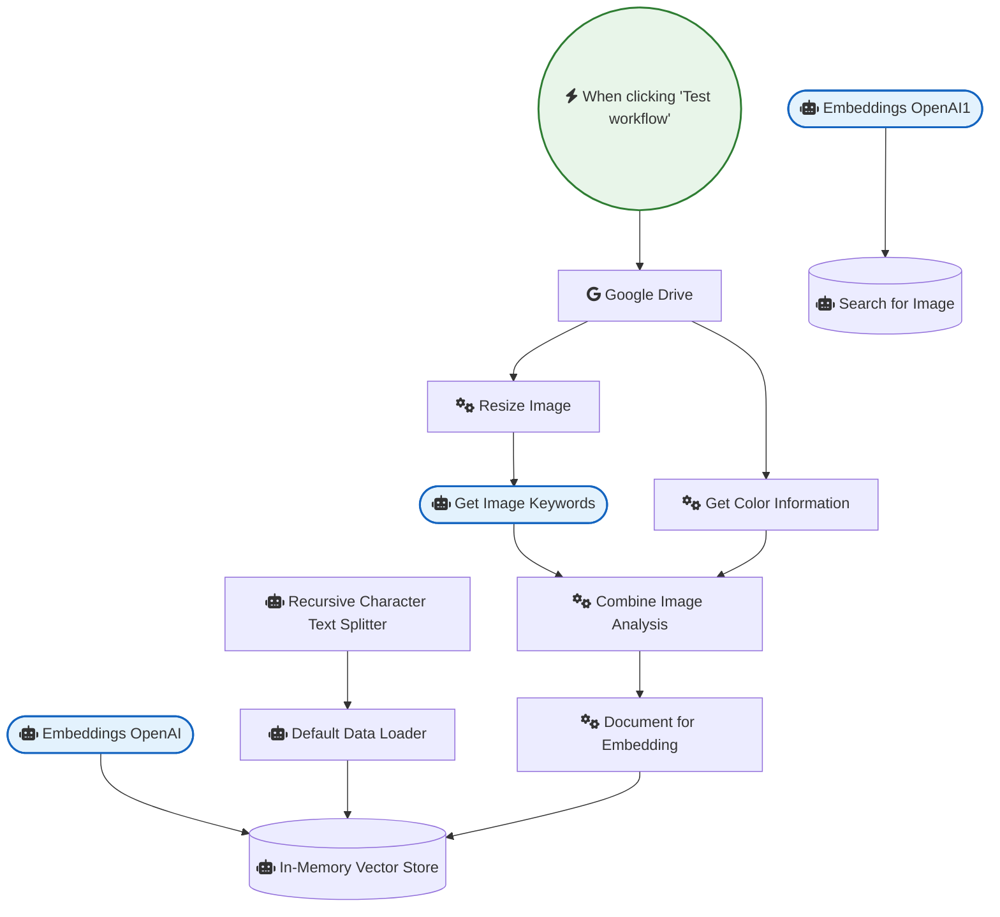

```mermaid
graph TD
    classDef trigger fill:#e8f5e9,stroke:#2e7d32,stroke-width:2px;
    classDef ai fill:#e3f2fd,stroke:#1565c0,stroke-width:2px;
    classDef logic fill:#fff3e0,stroke:#ef6c00,stroke-width:2px;

    When_clicking__Test_workflow_(("fas:fa-bolt When clicking 'Test workflow'")):::trigger
    Google_Drive["fab:fa-google Google Drive"]
    Get_Color_Information["fas:fa-cogs Get Color Information"]
    Resize_Image["fas:fa-cogs Resize Image"]
    Default_Data_Loader["fas:fa-robot Default Data Loader"]
    Recursive_Character_Text_Splitter["fas:fa-robot Recursive Character Text Splitter"]
    Combine_Image_Analysis["fas:fa-cogs Combine Image Analysis"]
    Document_for_Embedding["fas:fa-cogs Document for Embedding"]
    Embeddings_OpenAI1(["fas:fa-robot Embeddings OpenAI1"]):::ai
    Get_Image_Keywords(["fas:fa-robot Get Image Keywords"]):::ai
    In_Memory_Vector_Store[("fas:fa-robot In-Memory Vector Store")]
    Embeddings_OpenAI(["fas:fa-robot Embeddings OpenAI"]):::ai
    Search_for_Image[("fas:fa-robot Search for Image")]

    Google_Drive --> Get_Color_Information
    Google_Drive --> Resize_Image
    Resize_Image --> Get_Image_Keywords
    Embeddings_OpenAI --> In_Memory_Vector_Store
    Embeddings_OpenAI1 --> Search_for_Image
    Get_Image_Keywords --> Combine_Image_Analysis
    Default_Data_Loader --> In_Memory_Vector_Store
    Get_Color_Information --> Combine_Image_Analysis
    Combine_Image_Analysis --> Document_for_Embedding
    Document_for_Embedding --> In_Memory_Vector_Store
    When_clicking__Test_workflow_ --> Google_Drive
    Recursive_Character_Text_Splitter --> Default_Data_Loader
```
