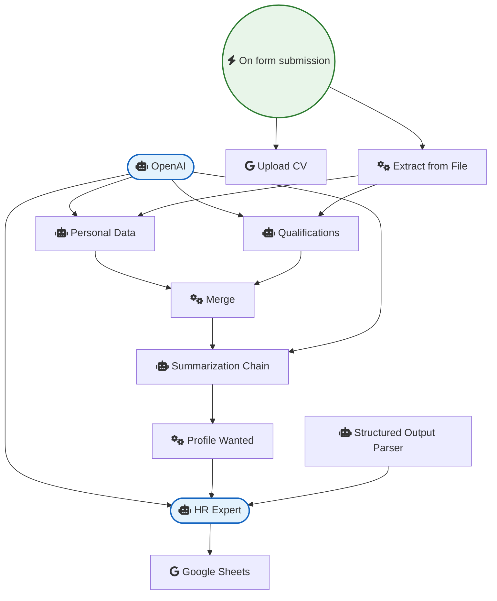

```mermaid
graph TD
    classDef trigger fill:#e8f5e9,stroke:#2e7d32,stroke-width:2px;
    classDef ai fill:#e3f2fd,stroke:#1565c0,stroke-width:2px;
    classDef logic fill:#fff3e0,stroke:#ef6c00,stroke-width:2px;

    On_form_submission(("fas:fa-bolt On form submission")):::trigger
    Extract_from_File["fas:fa-cogs Extract from File"]
    Qualifications["fas:fa-robot Qualifications"]
    Summarization_Chain["fas:fa-robot Summarization Chain"]
    Merge["fas:fa-cogs Merge"]
    Profile_Wanted["fas:fa-cogs Profile Wanted"]
    Google_Sheets["fab:fa-google Google Sheets"]
    Structured_Output_Parser["fas:fa-robot Structured Output Parser"]
    HR_Expert(["fas:fa-robot HR Expert"]):::ai
    Personal_Data["fas:fa-robot Personal Data"]
    Upload_CV["fab:fa-google Upload CV"]
    OpenAI(["fas:fa-robot OpenAI"]):::ai

    Merge --> Summarization_Chain
    OpenAI --> Qualifications
    OpenAI --> Summarization_Chain
    OpenAI --> HR_Expert
    OpenAI --> Personal_Data
    HR_Expert --> Google_Sheets
    Personal_Data --> Merge
    Profile_Wanted --> HR_Expert
    Qualifications --> Merge
    Extract_from_File --> Qualifications
    Extract_from_File --> Personal_Data
    On_form_submission --> Extract_from_File
    On_form_submission --> Upload_CV
    Summarization_Chain --> Profile_Wanted
    Structured_Output_Parser --> HR_Expert
```
