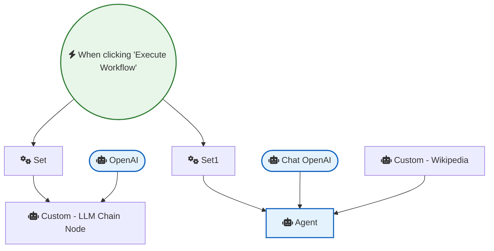

```mermaid
graph TD
    classDef trigger fill:#e8f5e9,stroke:#2e7d32,stroke-width:2px;
    classDef ai fill:#e3f2fd,stroke:#1565c0,stroke-width:2px;
    classDef logic fill:#fff3e0,stroke:#ef6c00,stroke-width:2px;

    OpenAI(["fas:fa-robot OpenAI"]):::ai
    When_clicking__Execute_Workflow_(("fas:fa-bolt When clicking 'Execute Workflow'")):::trigger
    Set["fas:fa-cogs Set"]
    Set1["fas:fa-cogs Set1"]
    Chat_OpenAI(["fas:fa-robot Chat OpenAI"]):::ai
    Custom___Wikipedia["fas:fa-robot Custom - Wikipedia"]
    Custom___LLM_Chain_Node["fas:fa-robot Custom - LLM Chain Node"]
    Agent["fas:fa-robot Agent"]:::ai

    Set --> Custom___LLM_Chain_Node
    Set1 --> Agent
    OpenAI --> Custom___LLM_Chain_Node
    Chat_OpenAI --> Agent
    Custom___Wikipedia --> Agent
    When_clicking__Execute_Workflow_ --> Set
    When_clicking__Execute_Workflow_ --> Set1
```
