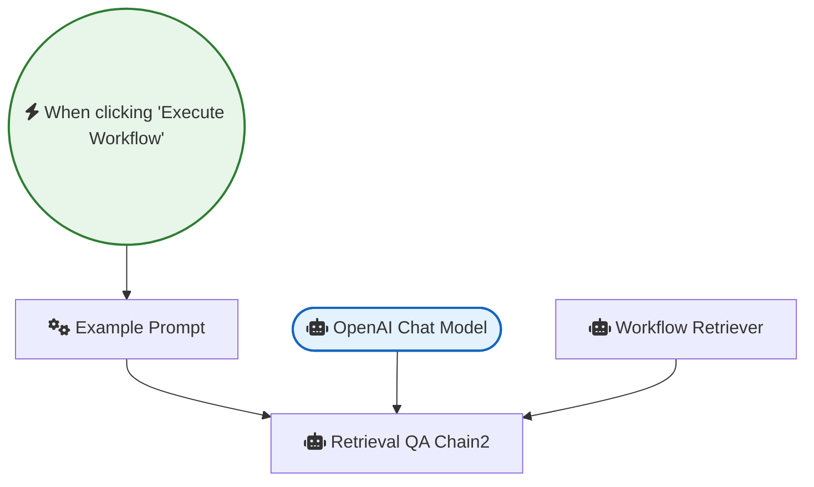

```mermaid
graph TD
    classDef trigger fill:#e8f5e9,stroke:#2e7d32,stroke-width:2px;
    classDef ai fill:#e3f2fd,stroke:#1565c0,stroke-width:2px;
    classDef logic fill:#fff3e0,stroke:#ef6c00,stroke-width:2px;

    When_clicking__Execute_Workflow_(("fas:fa-bolt When clicking 'Execute Workflow'")):::trigger
    Workflow_Retriever["fas:fa-robot Workflow Retriever"]
    Retrieval_QA_Chain2["fas:fa-robot Retrieval QA Chain2"]
    OpenAI_Chat_Model(["fas:fa-robot OpenAI Chat Model"]):::ai
    Example_Prompt["fas:fa-cogs Example Prompt"]

    Example_Prompt --> Retrieval_QA_Chain2
    OpenAI_Chat_Model --> Retrieval_QA_Chain2
    Workflow_Retriever --> Retrieval_QA_Chain2
    When_clicking__Execute_Workflow_ --> Example_Prompt
```
