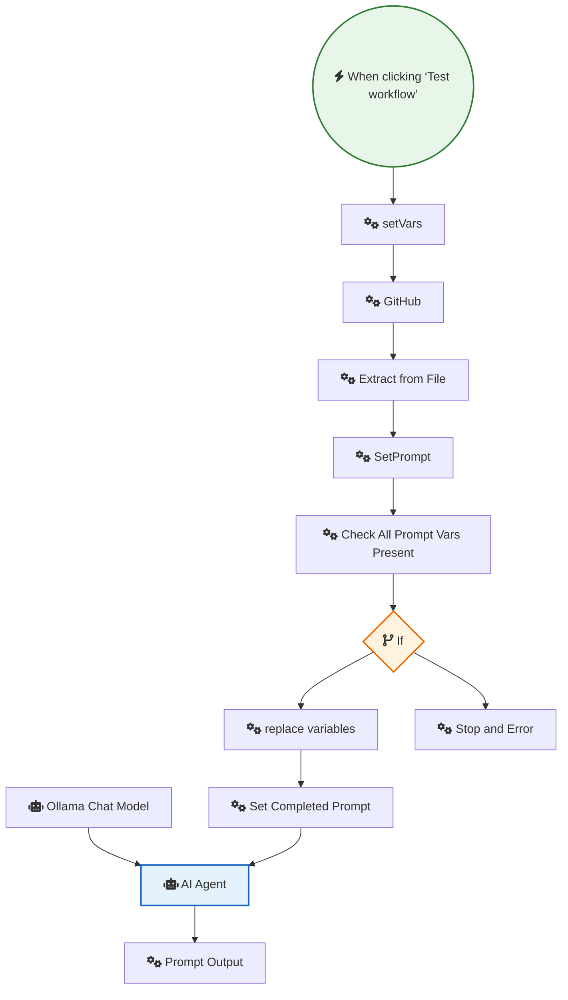

```mermaid
graph TD
    classDef trigger fill:#e8f5e9,stroke:#2e7d32,stroke-width:2px;
    classDef ai fill:#e3f2fd,stroke:#1565c0,stroke-width:2px;
    classDef logic fill:#fff3e0,stroke:#ef6c00,stroke-width:2px;

    When_clicking__Test_workflow_(("fas:fa-bolt When clicking ‘Test workflow’")):::trigger
    GitHub["fas:fa-cogs GitHub"]
    Extract_from_File["fas:fa-cogs Extract from File"]
    setVars["fas:fa-cogs setVars"]
    replace_variables["fas:fa-cogs replace variables"]
    If{"fas:fa-code-branch If"}:::logic
    Check_All_Prompt_Vars_Present["fas:fa-cogs Check All Prompt Vars Present"]
    SetPrompt["fas:fa-cogs SetPrompt"]
    Stop_and_Error["fas:fa-cogs Stop and Error"]
    Set_Completed_Prompt["fas:fa-cogs Set Completed Prompt"]
    AI_Agent["fas:fa-robot AI Agent"]:::ai
    Prompt_Output["fas:fa-cogs Prompt Output"]
    Ollama_Chat_Model["fas:fa-robot Ollama Chat Model"]

    If --> replace_variables
    If --> Stop_and_Error
    GitHub --> Extract_from_File
    setVars --> GitHub
    AI_Agent --> Prompt_Output
    SetPrompt --> Check_All_Prompt_Vars_Present
    Extract_from_File --> SetPrompt
    Ollama_Chat_Model --> AI_Agent
    replace_variables --> Set_Completed_Prompt
    Set_Completed_Prompt --> AI_Agent
    Check_All_Prompt_Vars_Present --> If
    When_clicking__Test_workflow_ --> setVars
```
