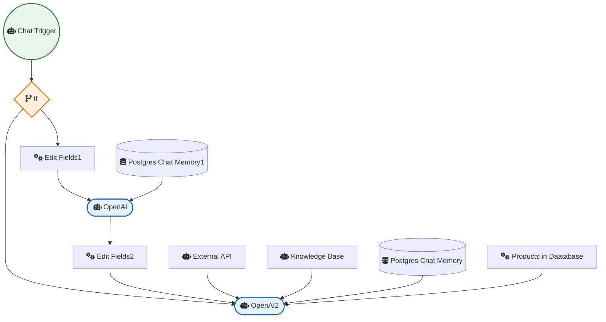

```mermaid
graph TD
    classDef trigger fill:#e8f5e9,stroke:#2e7d32,stroke-width:2px;
    classDef ai fill:#e3f2fd,stroke:#1565c0,stroke-width:2px;
    classDef logic fill:#fff3e0,stroke:#ef6c00,stroke-width:2px;

    If{"fas:fa-code-branch If"}:::logic
    Edit_Fields1["fas:fa-cogs Edit Fields1"]
    Edit_Fields2["fas:fa-cogs Edit Fields2"]
    OpenAI(["fas:fa-robot OpenAI"]):::ai
    Chat_Trigger(("fas:fa-robot Chat Trigger")):::trigger
    Postgres_Chat_Memory[("fas:fa-database Postgres Chat Memory")]
    Postgres_Chat_Memory1[("fas:fa-database Postgres Chat Memory1")]
    Products_in_Daatabase["fas:fa-cogs Products in Daatabase"]
    Knowledge_Base["fas:fa-robot Knowledge Base"]
    External_API["fas:fa-robot External API"]
    OpenAI2(["fas:fa-robot OpenAI2"]):::ai

    If --> Edit_Fields1
    If --> OpenAI2
    OpenAI --> Edit_Fields2
    Chat_Trigger --> If
    Edit_Fields1 --> OpenAI
    Edit_Fields2 --> OpenAI2
    External_API --> OpenAI2
    Knowledge_Base --> OpenAI2
    Postgres_Chat_Memory --> OpenAI2
    Postgres_Chat_Memory1 --> OpenAI
    Products_in_Daatabase --> OpenAI2
```
