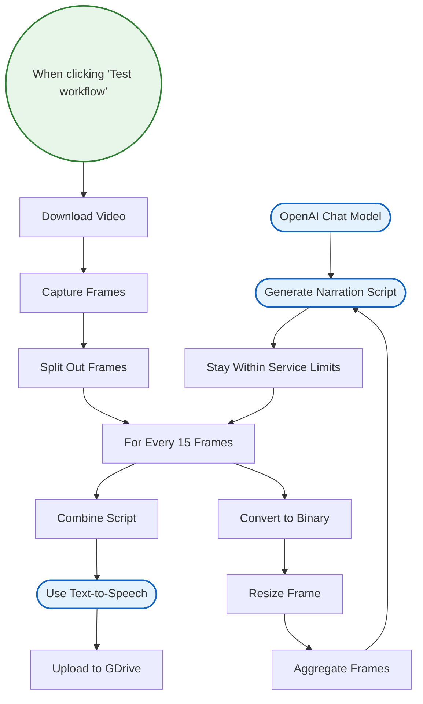

```mermaid
graph TD
    classDef trigger fill:#e8f5e9,stroke:#2e7d32,stroke-width:2px;
    classDef ai fill:#e3f2fd,stroke:#1565c0,stroke-width:2px;
    classDef logic fill:#fff3e0,stroke:#ef6c00,stroke-width:2px;

    OpenAI_Chat_Model(["OpenAI Chat Model"]):::ai
    Capture_Frames["Capture Frames"]
    Split_Out_Frames["Split Out Frames"]
    Download_Video["Download Video"]
    Convert_to_Binary["Convert to Binary"]
    When_clicking__Test_workflow_(("When clicking ‘Test workflow’")):::trigger
    Combine_Script["Combine Script"]
    Upload_to_GDrive["Upload to GDrive"]
    Stay_Within_Service_Limits["Stay Within Service Limits"]
    For_Every_15_Frames["For Every 15 Frames"]
    Resize_Frame["Resize Frame"]
    Aggregate_Frames["Aggregate Frames"]
    Use_Text_to_Speech(["Use Text-to-Speech"]):::ai
    Generate_Narration_Script(["Generate Narration Script"]):::ai

    Resize_Frame --> Aggregate_Frames
    Capture_Frames --> Split_Out_Frames
    Combine_Script --> Use_Text_to_Speech
    Download_Video --> Capture_Frames
    Aggregate_Frames --> Generate_Narration_Script
    Split_Out_Frames --> For_Every_15_Frames
    Convert_to_Binary --> Resize_Frame
    OpenAI_Chat_Model --> Generate_Narration_Script
    Use_Text_to_Speech --> Upload_to_GDrive
    For_Every_15_Frames --> Combine_Script
    For_Every_15_Frames --> Convert_to_Binary
    Generate_Narration_Script --> Stay_Within_Service_Limits
    Stay_Within_Service_Limits --> For_Every_15_Frames
    When_clicking__Test_workflow_ --> Download_Video
```
