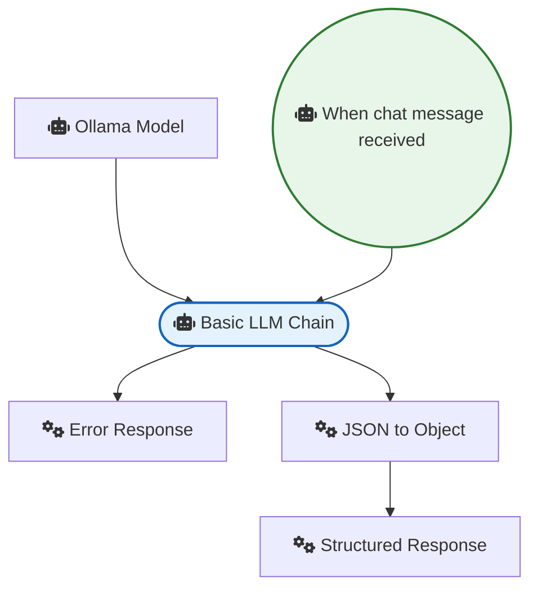

```mermaid
graph TD
    classDef trigger fill:#e8f5e9,stroke:#2e7d32,stroke-width:2px;
    classDef ai fill:#e3f2fd,stroke:#1565c0,stroke-width:2px;
    classDef logic fill:#fff3e0,stroke:#ef6c00,stroke-width:2px;

    When_chat_message_received(("fas:fa-robot When chat message received")):::trigger
    Basic_LLM_Chain(["fas:fa-robot Basic LLM Chain"]):::ai
    Ollama_Model["fas:fa-robot Ollama Model"]
    Structured_Response["fas:fa-cogs Structured Response"]
    Error_Response["fas:fa-cogs Error Response"]
    JSON_to_Object["fas:fa-cogs JSON to Object"]

    Ollama_Model --> Basic_LLM_Chain
    JSON_to_Object --> Structured_Response
    Basic_LLM_Chain --> JSON_to_Object
    Basic_LLM_Chain --> Error_Response
    When_chat_message_received --> Basic_LLM_Chain
```
