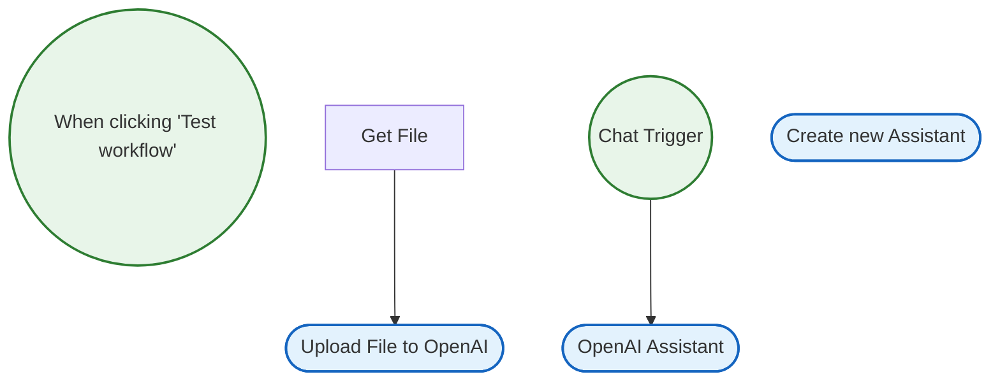

```mermaid
graph TD
    classDef trigger fill:#e8f5e9,stroke:#2e7d32,stroke-width:2px;
    classDef ai fill:#e3f2fd,stroke:#1565c0,stroke-width:2px;
    classDef logic fill:#fff3e0,stroke:#ef6c00,stroke-width:2px;

    When_clicking__Test_workflow_(("When clicking 'Test workflow'")):::trigger
    Get_File["Get File"]
    Chat_Trigger(("Chat Trigger")):::trigger
    OpenAI_Assistant(["OpenAI Assistant"]):::ai
    Upload_File_to_OpenAI(["Upload File to OpenAI"]):::ai
    Create_new_Assistant(["Create new Assistant"]):::ai

    Get_File --> Upload_File_to_OpenAI
    Chat_Trigger --> OpenAI_Assistant
```
