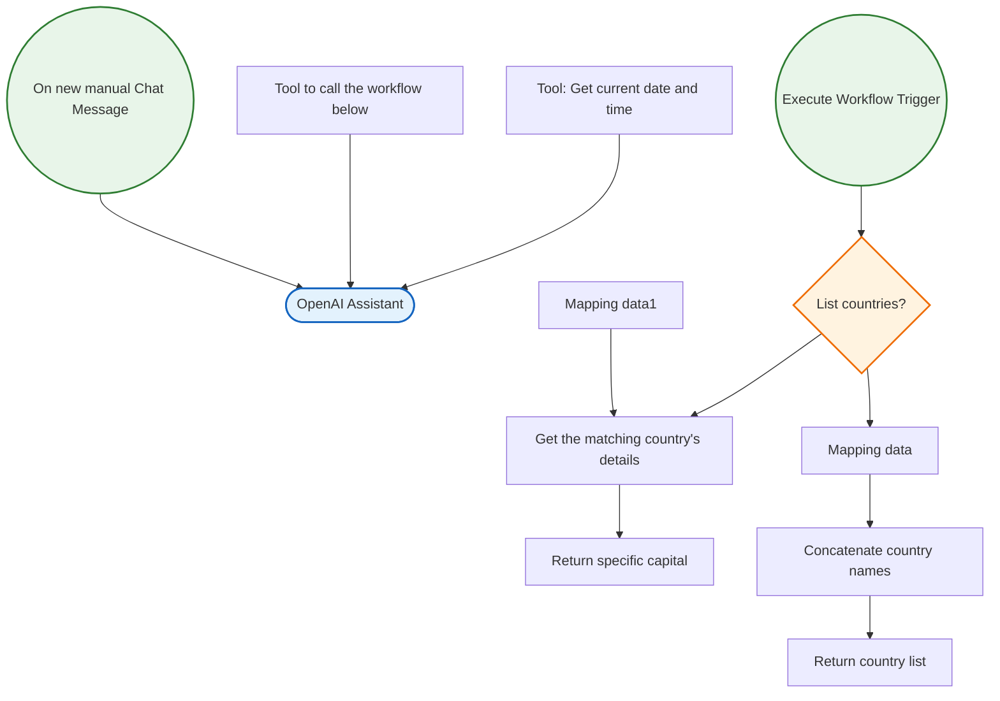

```mermaid
graph TD
    classDef trigger fill:#e8f5e9,stroke:#2e7d32,stroke-width:2px;
    classDef ai fill:#e3f2fd,stroke:#1565c0,stroke-width:2px;
    classDef logic fill:#fff3e0,stroke:#ef6c00,stroke-width:2px;

    On_new_manual_Chat_Message(("On new manual Chat Message")):::trigger
    OpenAI_Assistant(["OpenAI Assistant"]):::ai
    Execute_Workflow_Trigger(("Execute Workflow Trigger")):::trigger
    Mapping_data["Mapping data"]
    List_countries_{"List countries?"}:::logic
    Mapping_data1["Mapping data1"]
    Return_country_list["Return country list"]
    Return_specific_capital["Return specific capital"]
    Tool_to_call_the_workflow_below["Tool to call the workflow below"]
    Concatenate_country_names["Concatenate country names"]
    Get_the_matching_country_s_details["Get the matching country's details"]
    Tool__Get_current_date_and_time["Tool: Get current date and time"]

    Mapping_data --> Concatenate_country_names
    Mapping_data1 --> Get_the_matching_country_s_details
    List_countries_ --> Mapping_data
    List_countries_ --> Get_the_matching_country_s_details
    Execute_Workflow_Trigger --> List_countries_
    Concatenate_country_names --> Return_country_list
    On_new_manual_Chat_Message --> OpenAI_Assistant
    Tool_to_call_the_workflow_below --> OpenAI_Assistant
    Tool__Get_current_date_and_time --> OpenAI_Assistant
    Get_the_matching_country_s_details --> Return_specific_capital
```
