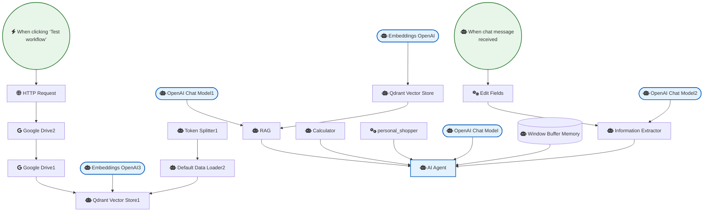

```mermaid
graph TD
    classDef trigger fill:#e8f5e9,stroke:#2e7d32,stroke-width:2px;
    classDef ai fill:#e3f2fd,stroke:#1565c0,stroke-width:2px;
    classDef logic fill:#fff3e0,stroke:#ef6c00,stroke-width:2px;

    When_chat_message_received(("fas:fa-robot When chat message received")):::trigger
    Window_Buffer_Memory[("fas:fa-robot Window Buffer Memory")]
    Calculator["fas:fa-robot Calculator"]
    Edit_Fields["fas:fa-cogs Edit Fields"]
    OpenAI_Chat_Model(["fas:fa-robot OpenAI Chat Model"]):::ai
    RAG["fas:fa-robot RAG"]
    Qdrant_Vector_Store["fas:fa-robot Qdrant Vector Store"]
    Embeddings_OpenAI(["fas:fa-robot Embeddings OpenAI"]):::ai
    OpenAI_Chat_Model1(["fas:fa-robot OpenAI Chat Model1"]):::ai
    personal_shopper["fas:fa-cogs personal_shopper"]
    Information_Extractor["fas:fa-robot Information Extractor"]
    OpenAI_Chat_Model2(["fas:fa-robot OpenAI Chat Model2"]):::ai
    Google_Drive2["fab:fa-google Google Drive2"]
    Google_Drive1["fab:fa-google Google Drive1"]
    Embeddings_OpenAI3(["fas:fa-robot Embeddings OpenAI3"]):::ai
    Default_Data_Loader2["fas:fa-robot Default Data Loader2"]
    Token_Splitter1["fas:fa-robot Token Splitter1"]
    When_clicking__Test_workflow_(("fas:fa-bolt When clicking ‘Test workflow’")):::trigger
    HTTP_Request["fas:fa-globe HTTP Request"]
    Qdrant_Vector_Store1["fas:fa-robot Qdrant Vector Store1"]
    AI_Agent["fas:fa-robot AI Agent"]:::ai

    RAG --> AI_Agent
    Calculator --> AI_Agent
    Edit_Fields --> Information_Extractor
    HTTP_Request --> Google_Drive2
    Google_Drive1 --> Qdrant_Vector_Store1
    Google_Drive2 --> Google_Drive1
    Token_Splitter1 --> Default_Data_Loader2
    personal_shopper --> AI_Agent
    Embeddings_OpenAI --> Qdrant_Vector_Store
    OpenAI_Chat_Model --> AI_Agent
    Embeddings_OpenAI3 --> Qdrant_Vector_Store1
    OpenAI_Chat_Model1 --> RAG
    OpenAI_Chat_Model2 --> Information_Extractor
    Qdrant_Vector_Store --> RAG
    Default_Data_Loader2 --> Qdrant_Vector_Store1
    Window_Buffer_Memory --> AI_Agent
    Information_Extractor --> AI_Agent
    When_chat_message_received --> Edit_Fields
    When_clicking__Test_workflow_ --> HTTP_Request
```
