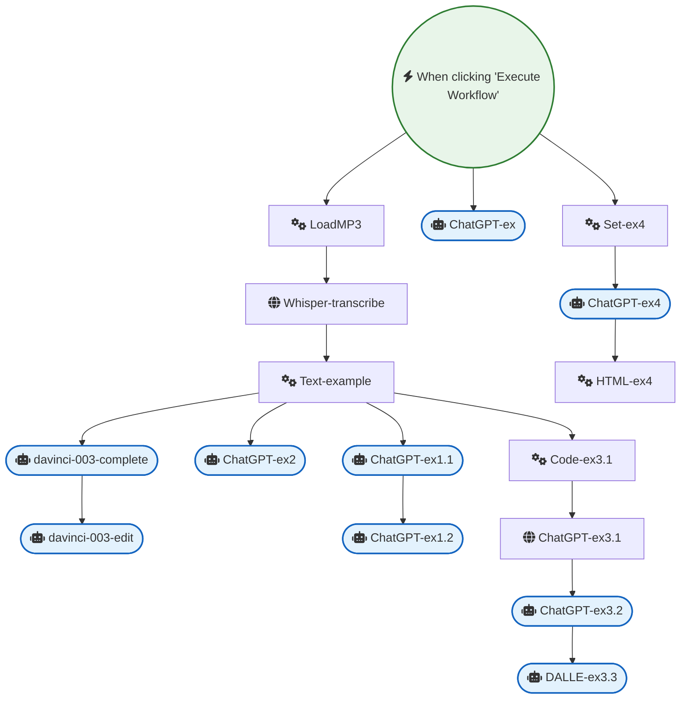

```mermaid
graph TD
    classDef trigger fill:#e8f5e9,stroke:#2e7d32,stroke-width:2px;
    classDef ai fill:#e3f2fd,stroke:#1565c0,stroke-width:2px;
    classDef logic fill:#fff3e0,stroke:#ef6c00,stroke-width:2px;

    When_clicking__Execute_Workflow_(("fas:fa-bolt When clicking 'Execute Workflow'")):::trigger
    davinci_003_complete(["fas:fa-robot davinci-003-complete"]):::ai
    ChatGPT_ex2(["fas:fa-robot ChatGPT-ex2"]):::ai
    davinci_003_edit(["fas:fa-robot davinci-003-edit"]):::ai
    ChatGPT_ex1_1(["fas:fa-robot ChatGPT-ex1.1"]):::ai
    ChatGPT_ex1_2(["fas:fa-robot ChatGPT-ex1.2"]):::ai
    Text_example["fas:fa-cogs Text-example"]
    Code_ex3_1["fas:fa-cogs Code-ex3.1"]
    ChatGPT_ex3_1["fas:fa-globe ChatGPT-ex3.1"]
    ChatGPT_ex3_2(["fas:fa-robot ChatGPT-ex3.2"]):::ai
    DALLE_ex3_3(["fas:fa-robot DALLE-ex3.3"]):::ai
    ChatGPT_ex4(["fas:fa-robot ChatGPT-ex4"]):::ai
    Set_ex4["fas:fa-cogs Set-ex4"]
    HTML_ex4["fas:fa-cogs HTML-ex4"]
    ChatGPT_ex(["fas:fa-robot ChatGPT-ex"]):::ai
    LoadMP3["fas:fa-cogs LoadMP3"]
    Whisper_transcribe["fas:fa-globe Whisper-transcribe"]

    LoadMP3 --> Whisper_transcribe
    Set_ex4 --> ChatGPT_ex4
    Code_ex3_1 --> ChatGPT_ex3_1
    ChatGPT_ex4 --> HTML_ex4
    Text_example --> davinci_003_complete
    Text_example --> ChatGPT_ex1_1
    Text_example --> ChatGPT_ex2
    Text_example --> Code_ex3_1
    ChatGPT_ex1_1 --> ChatGPT_ex1_2
    ChatGPT_ex3_1 --> ChatGPT_ex3_2
    ChatGPT_ex3_2 --> DALLE_ex3_3
    Whisper_transcribe --> Text_example
    davinci_003_complete --> davinci_003_edit
    When_clicking__Execute_Workflow_ --> LoadMP3
    When_clicking__Execute_Workflow_ --> Set_ex4
    When_clicking__Execute_Workflow_ --> ChatGPT_ex
```
