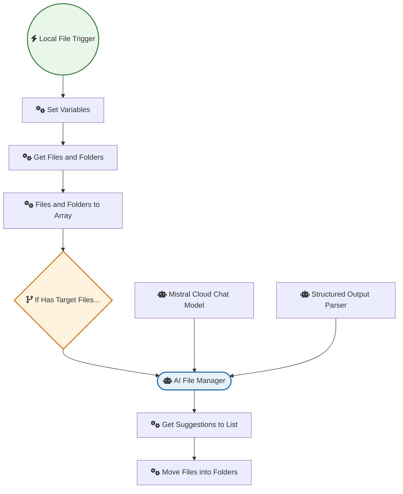

```mermaid
graph TD
    classDef trigger fill:#e8f5e9,stroke:#2e7d32,stroke-width:2px;
    classDef ai fill:#e3f2fd,stroke:#1565c0,stroke-width:2px;
    classDef logic fill:#fff3e0,stroke:#ef6c00,stroke-width:2px;

    Local_File_Trigger(("fas:fa-bolt Local File Trigger")):::trigger
    Get_Files_and_Folders["fas:fa-cogs Get Files and Folders"]
    Files_and_Folders_to_Array["fas:fa-cogs Files and Folders to Array"]
    Mistral_Cloud_Chat_Model["fas:fa-robot Mistral Cloud Chat Model"]
    Structured_Output_Parser["fas:fa-robot Structured Output Parser"]
    Set_Variables["fas:fa-cogs Set Variables"]
    Move_Files_into_Folders["fas:fa-cogs Move Files into Folders"]
    If_Has_Target_Files___{"fas:fa-code-branch If Has Target Files..."}:::logic
    Get_Suggestions_to_List["fas:fa-cogs Get Suggestions to List"]
    AI_File_Manager(["fas:fa-robot AI File Manager"]):::ai

    Set_Variables --> Get_Files_and_Folders
    AI_File_Manager --> Get_Suggestions_to_List
    Local_File_Trigger --> Set_Variables
    Get_Files_and_Folders --> Files_and_Folders_to_Array
    If_Has_Target_Files___ --> AI_File_Manager
    Get_Suggestions_to_List --> Move_Files_into_Folders
    Mistral_Cloud_Chat_Model --> AI_File_Manager
    Structured_Output_Parser --> AI_File_Manager
    Files_and_Folders_to_Array --> If_Has_Target_Files___
```
