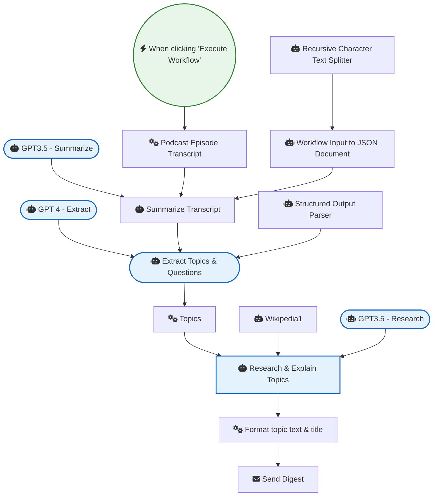

```mermaid
graph TD
    classDef trigger fill:#e8f5e9,stroke:#2e7d32,stroke-width:2px;
    classDef ai fill:#e3f2fd,stroke:#1565c0,stroke-width:2px;
    classDef logic fill:#fff3e0,stroke:#ef6c00,stroke-width:2px;

    When_clicking__Execute_Workflow_(("fas:fa-bolt When clicking 'Execute Workflow'")):::trigger
    Podcast_Episode_Transcript["fas:fa-cogs Podcast Episode Transcript"]
    Workflow_Input_to_JSON_Document["fas:fa-robot Workflow Input to JSON Document"]
    Recursive_Character_Text_Splitter["fas:fa-robot Recursive Character Text Splitter"]
    Topics["fas:fa-cogs Topics"]
    Summarize_Transcript["fas:fa-robot Summarize Transcript"]
    GPT_4___Extract(["fas:fa-robot GPT 4 - Extract"]):::ai
    Wikipedia1["fas:fa-robot Wikipedia1"]
    Send_Digest["fas:fa-envelope Send Digest"]
    Format_topic_text___title["fas:fa-cogs Format topic text & title"]
    Structured_Output_Parser["fas:fa-robot Structured Output Parser"]
    Extract_Topics___Questions(["fas:fa-robot Extract Topics & Questions"]):::ai
    GPT3_5___Research(["fas:fa-robot GPT3.5 - Research"]):::ai
    GPT3_5___Summarize(["fas:fa-robot GPT3.5 - Summarize"]):::ai
    Research___Explain_Topics["fas:fa-robot Research & Explain Topics"]:::ai

    Topics --> Research___Explain_Topics
    Wikipedia1 --> Research___Explain_Topics
    GPT_4___Extract --> Extract_Topics___Questions
    GPT3_5___Research --> Research___Explain_Topics
    GPT3_5___Summarize --> Summarize_Transcript
    Summarize_Transcript --> Extract_Topics___Questions
    Structured_Output_Parser --> Extract_Topics___Questions
    Format_topic_text___title --> Send_Digest
    Research___Explain_Topics --> Format_topic_text___title
    Extract_Topics___Questions --> Topics
    Podcast_Episode_Transcript --> Summarize_Transcript
    Workflow_Input_to_JSON_Document --> Summarize_Transcript
    When_clicking__Execute_Workflow_ --> Podcast_Episode_Transcript
    Recursive_Character_Text_Splitter --> Workflow_Input_to_JSON_Document
```
