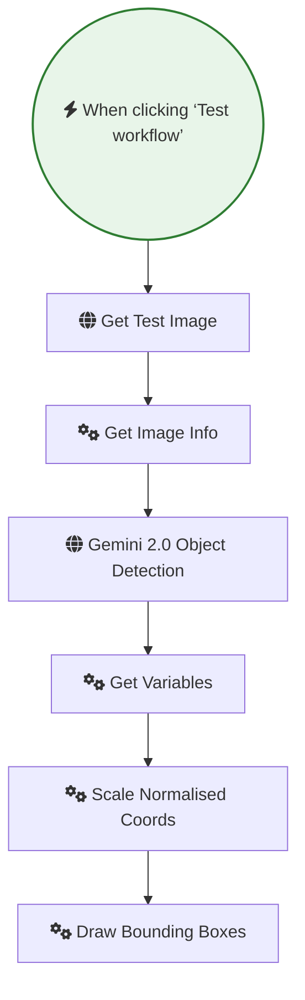

```mermaid
graph TD
    classDef trigger fill:#e8f5e9,stroke:#2e7d32,stroke-width:2px;
    classDef ai fill:#e3f2fd,stroke:#1565c0,stroke-width:2px;
    classDef logic fill:#fff3e0,stroke:#ef6c00,stroke-width:2px;

    When_clicking__Test_workflow_(("fas:fa-bolt When clicking ‘Test workflow’")):::trigger
    Get_Variables["fas:fa-cogs Get Variables"]
    Get_Test_Image["fas:fa-globe Get Test Image"]
    Gemini_2_0_Object_Detection["fas:fa-globe Gemini 2.0 Object Detection"]
    Scale_Normalised_Coords["fas:fa-cogs Scale Normalised Coords"]
    Draw_Bounding_Boxes["fas:fa-cogs Draw Bounding Boxes"]
    Get_Image_Info["fas:fa-cogs Get Image Info"]

    Get_Variables --> Scale_Normalised_Coords
    Get_Image_Info --> Gemini_2_0_Object_Detection
    Get_Test_Image --> Get_Image_Info
    Scale_Normalised_Coords --> Draw_Bounding_Boxes
    Gemini_2_0_Object_Detection --> Get_Variables
    When_clicking__Test_workflow_ --> Get_Test_Image
```
