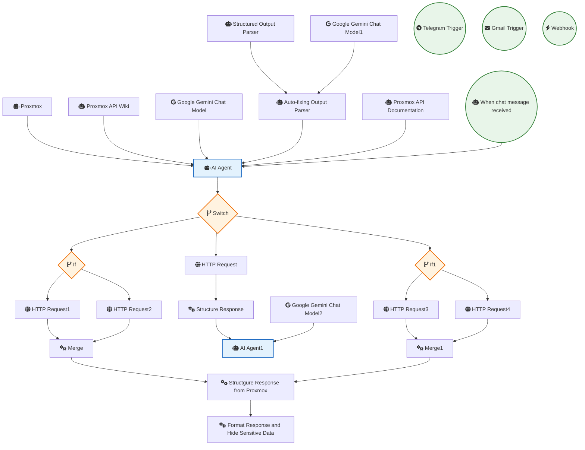

```mermaid
graph TD
    classDef trigger fill:#e8f5e9,stroke:#2e7d32,stroke-width:2px;
    classDef ai fill:#e3f2fd,stroke:#1565c0,stroke-width:2px;
    classDef logic fill:#fff3e0,stroke:#ef6c00,stroke-width:2px;

    HTTP_Request1["fas:fa-globe HTTP Request1"]
    Proxmox_API_Documentation["fas:fa-robot Proxmox API Documentation"]
    Auto_fixing_Output_Parser["fas:fa-robot Auto-fixing Output Parser"]
    Google_Gemini_Chat_Model1["fab:fa-google Google Gemini Chat Model1"]
    Structured_Output_Parser["fas:fa-robot Structured Output Parser"]
    Proxmox["fas:fa-robot Proxmox"]
    HTTP_Request["fas:fa-globe HTTP Request"]
    Google_Gemini_Chat_Model2["fab:fa-google Google Gemini Chat Model2"]
    When_chat_message_received(("fas:fa-robot When chat message received")):::trigger
    Telegram_Trigger(("fab:fa-telegram Telegram Trigger")):::trigger
    Gmail_Trigger(("fas:fa-envelope Gmail Trigger")):::trigger
    Webhook(("fas:fa-bolt Webhook")):::trigger
    Proxmox_API_Wiki["fas:fa-robot Proxmox API Wiki"]
    Structure_Response["fas:fa-cogs Structure Response"]
    Structgure_Response_from_Proxmox["fas:fa-cogs Structgure Response from Proxmox"]
    Format_Response_and_Hide_Sensitive_Data["fas:fa-cogs Format Response and Hide Sensitive Data"]
    If{"fas:fa-code-branch If"}:::logic
    HTTP_Request2["fas:fa-globe HTTP Request2"]
    Merge["fas:fa-cogs Merge"]
    HTTP_Request3["fas:fa-globe HTTP Request3"]
    Google_Gemini_Chat_Model["fab:fa-google Google Gemini Chat Model"]
    AI_Agent1["fas:fa-robot AI Agent1"]:::ai
    If1{"fas:fa-code-branch If1"}:::logic
    HTTP_Request4["fas:fa-globe HTTP Request4"]
    Merge1["fas:fa-cogs Merge1"]
    AI_Agent["fas:fa-robot AI Agent"]:::ai
    Switch{"fas:fa-code-branch Switch"}:::logic

    If --> HTTP_Request1
    If --> HTTP_Request2
    If1 --> HTTP_Request3
    If1 --> HTTP_Request4
    Merge --> Structgure_Response_from_Proxmox
    Merge1 --> Structgure_Response_from_Proxmox
    Switch --> HTTP_Request
    Switch --> If
    Switch --> If1
    Proxmox --> AI_Agent
    AI_Agent --> Switch
    HTTP_Request --> Structure_Response
    HTTP_Request1 --> Merge
    HTTP_Request2 --> Merge
    HTTP_Request3 --> Merge1
    HTTP_Request4 --> Merge1
    Proxmox_API_Wiki --> AI_Agent
    Structure_Response --> AI_Agent1
    Google_Gemini_Chat_Model --> AI_Agent
    Structured_Output_Parser --> Auto_fixing_Output_Parser
    Auto_fixing_Output_Parser --> AI_Agent
    Google_Gemini_Chat_Model1 --> Auto_fixing_Output_Parser
    Google_Gemini_Chat_Model2 --> AI_Agent1
    Proxmox_API_Documentation --> AI_Agent
    When_chat_message_received --> AI_Agent
    Structgure_Response_from_Proxmox --> Format_Response_and_Hide_Sensitive_Data
```
