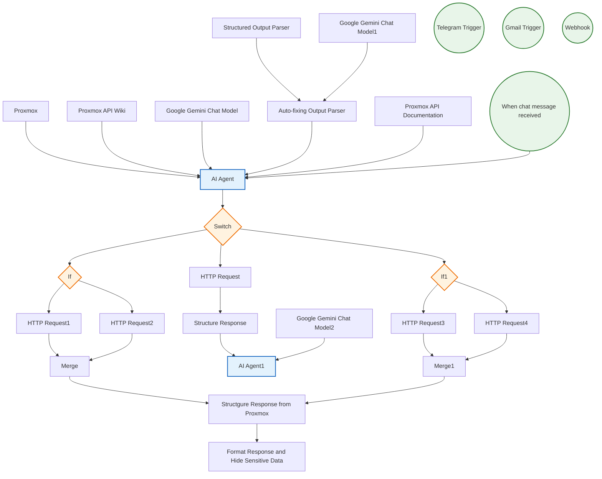

```mermaid
graph TD
    classDef trigger fill:#e8f5e9,stroke:#2e7d32,stroke-width:2px;
    classDef ai fill:#e3f2fd,stroke:#1565c0,stroke-width:2px;
    classDef logic fill:#fff3e0,stroke:#ef6c00,stroke-width:2px;

    HTTP_Request1["HTTP Request1"]
    Proxmox_API_Documentation["Proxmox API Documentation"]
    Auto_fixing_Output_Parser["Auto-fixing Output Parser"]
    Google_Gemini_Chat_Model1["Google Gemini Chat Model1"]
    Structured_Output_Parser["Structured Output Parser"]
    Proxmox["Proxmox"]
    HTTP_Request["HTTP Request"]
    Google_Gemini_Chat_Model2["Google Gemini Chat Model2"]
    When_chat_message_received(("When chat message received")):::trigger
    Telegram_Trigger(("Telegram Trigger")):::trigger
    Gmail_Trigger(("Gmail Trigger")):::trigger
    Webhook(("Webhook")):::trigger
    Proxmox_API_Wiki["Proxmox API Wiki"]
    Structure_Response["Structure Response"]
    Structgure_Response_from_Proxmox["Structgure Response from Proxmox"]
    Format_Response_and_Hide_Sensitive_Data["Format Response and Hide Sensitive Data"]
    If{"If"}:::logic
    HTTP_Request2["HTTP Request2"]
    Merge["Merge"]
    HTTP_Request3["HTTP Request3"]
    Google_Gemini_Chat_Model["Google Gemini Chat Model"]
    AI_Agent1["AI Agent1"]:::ai
    If1{"If1"}:::logic
    HTTP_Request4["HTTP Request4"]
    Merge1["Merge1"]
    AI_Agent["AI Agent"]:::ai
    Switch{"Switch"}:::logic

    If --> HTTP_Request1
    If --> HTTP_Request2
    If1 --> HTTP_Request3
    If1 --> HTTP_Request4
    Merge --> Structgure_Response_from_Proxmox
    Merge1 --> Structgure_Response_from_Proxmox
    Switch --> HTTP_Request
    Switch --> If
    Switch --> If1
    Proxmox --> AI_Agent
    AI_Agent --> Switch
    HTTP_Request --> Structure_Response
    HTTP_Request1 --> Merge
    HTTP_Request2 --> Merge
    HTTP_Request3 --> Merge1
    HTTP_Request4 --> Merge1
    Proxmox_API_Wiki --> AI_Agent
    Structure_Response --> AI_Agent1
    Google_Gemini_Chat_Model --> AI_Agent
    Structured_Output_Parser --> Auto_fixing_Output_Parser
    Auto_fixing_Output_Parser --> AI_Agent
    Google_Gemini_Chat_Model1 --> Auto_fixing_Output_Parser
    Google_Gemini_Chat_Model2 --> AI_Agent1
    Proxmox_API_Documentation --> AI_Agent
    When_chat_message_received --> AI_Agent
    Structgure_Response_from_Proxmox --> Format_Response_and_Hide_Sensitive_Data
```
