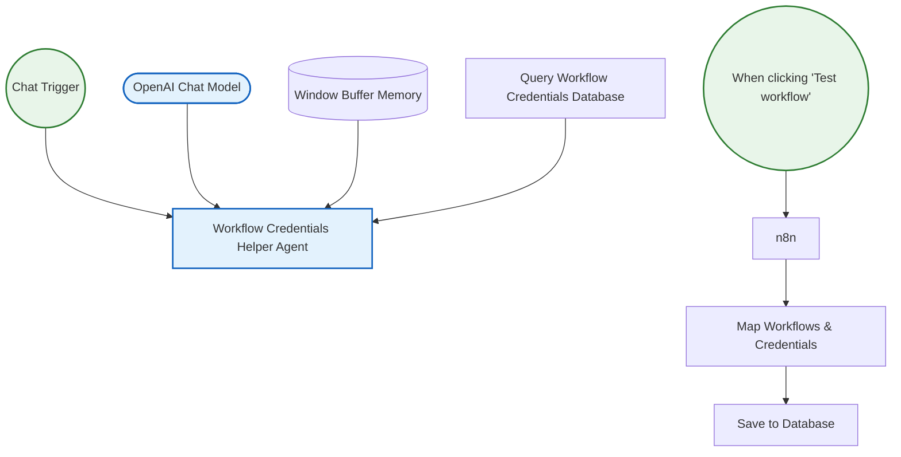

```mermaid
graph TD
    classDef trigger fill:#e8f5e9,stroke:#2e7d32,stroke-width:2px;
    classDef ai fill:#e3f2fd,stroke:#1565c0,stroke-width:2px;
    classDef logic fill:#fff3e0,stroke:#ef6c00,stroke-width:2px;

    When_clicking__Test_workflow_(("When clicking 'Test workflow'")):::trigger
    Map_Workflows___Credentials["Map Workflows & Credentials"]
    Save_to_Database["Save to Database"]
    Chat_Trigger(("Chat Trigger")):::trigger
    Query_Workflow_Credentials_Database["Query Workflow Credentials Database"]
    OpenAI_Chat_Model(["OpenAI Chat Model"]):::ai
    Window_Buffer_Memory[("Window Buffer Memory")]
    Workflow_Credentials_Helper_Agent["Workflow Credentials Helper Agent"]:::ai
    n8n["n8n"]

    n8n --> Map_Workflows___Credentials
    Chat_Trigger --> Workflow_Credentials_Helper_Agent
    OpenAI_Chat_Model --> Workflow_Credentials_Helper_Agent
    Window_Buffer_Memory --> Workflow_Credentials_Helper_Agent
    Map_Workflows___Credentials --> Save_to_Database
    When_clicking__Test_workflow_ --> n8n
    Query_Workflow_Credentials_Database --> Workflow_Credentials_Helper_Agent
```
