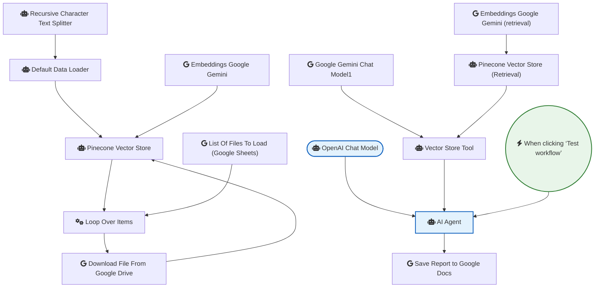

```mermaid
graph TD
    classDef trigger fill:#e8f5e9,stroke:#2e7d32,stroke-width:2px;
    classDef ai fill:#e3f2fd,stroke:#1565c0,stroke-width:2px;
    classDef logic fill:#fff3e0,stroke:#ef6c00,stroke-width:2px;

    Pinecone_Vector_Store["fas:fa-robot Pinecone Vector Store"]
    Embeddings_Google_Gemini["fab:fa-google Embeddings Google Gemini"]
    Default_Data_Loader["fas:fa-robot Default Data Loader"]
    Recursive_Character_Text_Splitter["fas:fa-robot Recursive Character Text Splitter"]
    Loop_Over_Items["fas:fa-cogs Loop Over Items"]
    When_clicking__Test_workflow_(("fas:fa-bolt When clicking ‘Test workflow’")):::trigger
    AI_Agent["fas:fa-robot AI Agent"]:::ai
    Vector_Store_Tool["fas:fa-robot Vector Store Tool"]
    Google_Gemini_Chat_Model1["fab:fa-google Google Gemini Chat Model1"]
    OpenAI_Chat_Model(["fas:fa-robot OpenAI Chat Model"]):::ai
    Pinecone_Vector_Store__Retrieval_["fas:fa-robot Pinecone Vector Store (Retrieval)"]
    Save_Report_to_Google_Docs["fab:fa-google Save Report to Google Docs"]
    Embeddings_Google_Gemini__retrieval_["fab:fa-google Embeddings Google Gemini (retrieval)"]
    List_Of_Files_To_Load__Google_Sheets_["fab:fa-google List Of Files To Load (Google Sheets)"]
    Download_File_From_Google_Drive["fab:fa-google Download File From Google Drive"]

    AI_Agent --> Save_Report_to_Google_Docs
    Loop_Over_Items --> Download_File_From_Google_Drive
    OpenAI_Chat_Model --> AI_Agent
    Vector_Store_Tool --> AI_Agent
    Default_Data_Loader --> Pinecone_Vector_Store
    Pinecone_Vector_Store --> Loop_Over_Items
    Embeddings_Google_Gemini --> Pinecone_Vector_Store
    Google_Gemini_Chat_Model1 --> Vector_Store_Tool
    Download_File_From_Google_Drive --> Pinecone_Vector_Store
    Pinecone_Vector_Store__Retrieval_ --> Vector_Store_Tool
    Recursive_Character_Text_Splitter --> Default_Data_Loader
    When_clicking__Test_workflow_ --> AI_Agent
    Embeddings_Google_Gemini__retrieval_ --> Pinecone_Vector_Store__Retrieval_
    List_Of_Files_To_Load__Google_Sheets_ --> Loop_Over_Items
```
