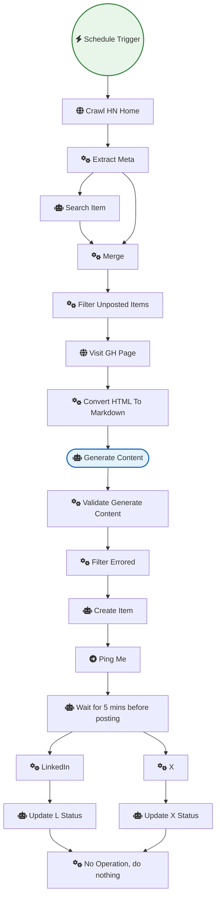

```mermaid
graph TD
    classDef trigger fill:#e8f5e9,stroke:#2e7d32,stroke-width:2px;
    classDef ai fill:#e3f2fd,stroke:#1565c0,stroke-width:2px;
    classDef logic fill:#fff3e0,stroke:#ef6c00,stroke-width:2px;

    Crawl_HN_Home["fas:fa-globe Crawl HN Home"]
    Extract_Meta["fas:fa-cogs Extract Meta"]
    Filter_Unposted_Items["fas:fa-cogs Filter Unposted Items"]
    Visit_GH_Page["fas:fa-globe Visit GH Page"]
    Convert_HTML_To_Markdown["fas:fa-cogs Convert HTML To Markdown"]
    Filter_Errored["fas:fa-cogs Filter Errored"]
    No_Operation__do_nothing["fas:fa-cogs No Operation, do nothing"]
    Update_X_Status["fas:fa-robot Update X Status"]
    LinkedIn["fas:fa-cogs LinkedIn"]
    Update_L_Status["fas:fa-robot Update L Status"]
    Search_Item["fas:fa-robot Search Item"]
    Create_Item["fas:fa-robot Create Item"]
    X["fas:fa-cogs X"]
    Validate_Generate_Content["fas:fa-cogs Validate Generate Content"]
    Schedule_Trigger(("fas:fa-bolt Schedule Trigger")):::trigger
    Merge["fas:fa-cogs Merge"]
    Generate_Content(["fas:fa-robot Generate Content"]):::ai
    Ping_Me["fab:fa-telegram Ping Me"]
    Wait_for_5_mins_before_posting["fas:fa-robot Wait for 5 mins before posting"]

    X --> Update_X_Status
    Merge --> Filter_Unposted_Items
    Ping_Me --> Wait_for_5_mins_before_posting
    LinkedIn --> Update_L_Status
    Create_Item --> Ping_Me
    Search_Item --> Merge
    Extract_Meta --> Search_Item
    Extract_Meta --> Merge
    Crawl_HN_Home --> Extract_Meta
    Visit_GH_Page --> Convert_HTML_To_Markdown
    Filter_Errored --> Create_Item
    Update_L_Status --> No_Operation__do_nothing
    Update_X_Status --> No_Operation__do_nothing
    Generate_Content --> Validate_Generate_Content
    Schedule_Trigger --> Crawl_HN_Home
    Filter_Unposted_Items --> Visit_GH_Page
    Convert_HTML_To_Markdown --> Generate_Content
    Validate_Generate_Content --> Filter_Errored
    Wait_for_5_mins_before_posting --> X
    Wait_for_5_mins_before_posting --> LinkedIn
```
