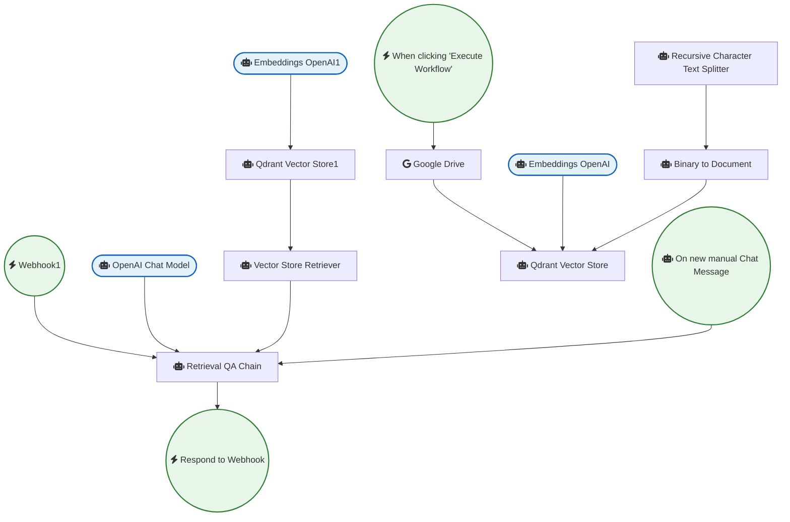

```mermaid
graph TD
    classDef trigger fill:#e8f5e9,stroke:#2e7d32,stroke-width:2px;
    classDef ai fill:#e3f2fd,stroke:#1565c0,stroke-width:2px;
    classDef logic fill:#fff3e0,stroke:#ef6c00,stroke-width:2px;

    Embeddings_OpenAI1(["fas:fa-robot Embeddings OpenAI1"]):::ai
    On_new_manual_Chat_Message(("fas:fa-robot On new manual Chat Message")):::trigger
    Retrieval_QA_Chain["fas:fa-robot Retrieval QA Chain"]
    Respond_to_Webhook(("fas:fa-bolt Respond to Webhook")):::trigger
    Vector_Store_Retriever["fas:fa-robot Vector Store Retriever"]
    Webhook1(("fas:fa-bolt Webhook1")):::trigger
    When_clicking__Execute_Workflow_(("fas:fa-bolt When clicking 'Execute Workflow'")):::trigger
    Google_Drive["fab:fa-google Google Drive"]
    Binary_to_Document["fas:fa-robot Binary to Document"]
    Recursive_Character_Text_Splitter["fas:fa-robot Recursive Character Text Splitter"]
    Embeddings_OpenAI(["fas:fa-robot Embeddings OpenAI"]):::ai
    Qdrant_Vector_Store["fas:fa-robot Qdrant Vector Store"]
    Qdrant_Vector_Store1["fas:fa-robot Qdrant Vector Store1"]
    OpenAI_Chat_Model(["fas:fa-robot OpenAI Chat Model"]):::ai

    Webhook1 --> Retrieval_QA_Chain
    Google_Drive --> Qdrant_Vector_Store
    Embeddings_OpenAI --> Qdrant_Vector_Store
    OpenAI_Chat_Model --> Retrieval_QA_Chain
    Binary_to_Document --> Qdrant_Vector_Store
    Embeddings_OpenAI1 --> Qdrant_Vector_Store1
    Retrieval_QA_Chain --> Respond_to_Webhook
    Qdrant_Vector_Store1 --> Vector_Store_Retriever
    Vector_Store_Retriever --> Retrieval_QA_Chain
    On_new_manual_Chat_Message --> Retrieval_QA_Chain
    When_clicking__Execute_Workflow_ --> Google_Drive
    Recursive_Character_Text_Splitter --> Binary_to_Document
```
