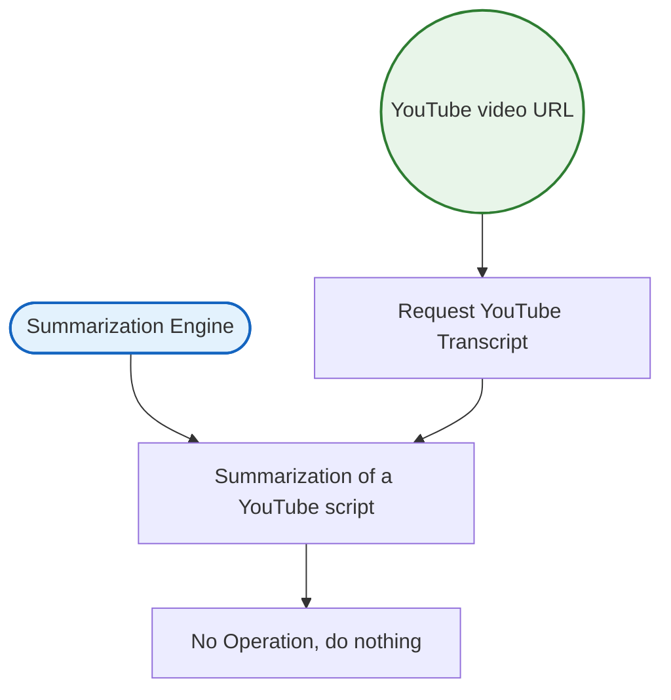

```mermaid
graph TD
    classDef trigger fill:#e8f5e9,stroke:#2e7d32,stroke-width:2px;
    classDef ai fill:#e3f2fd,stroke:#1565c0,stroke-width:2px;
    classDef logic fill:#fff3e0,stroke:#ef6c00,stroke-width:2px;

    Request_YouTube_Transcript["Request YouTube Transcript"]
    No_Operation__do_nothing["No Operation, do nothing"]
    Summarization_of_a_YouTube_script["Summarization of a YouTube script"]
    YouTube_video_URL(("YouTube video URL")):::trigger
    Summarization_Engine(["Summarization Engine"]):::ai

    YouTube_video_URL --> Request_YouTube_Transcript
    Summarization_Engine --> Summarization_of_a_YouTube_script
    Request_YouTube_Transcript --> Summarization_of_a_YouTube_script
    Summarization_of_a_YouTube_script --> No_Operation__do_nothing
```
