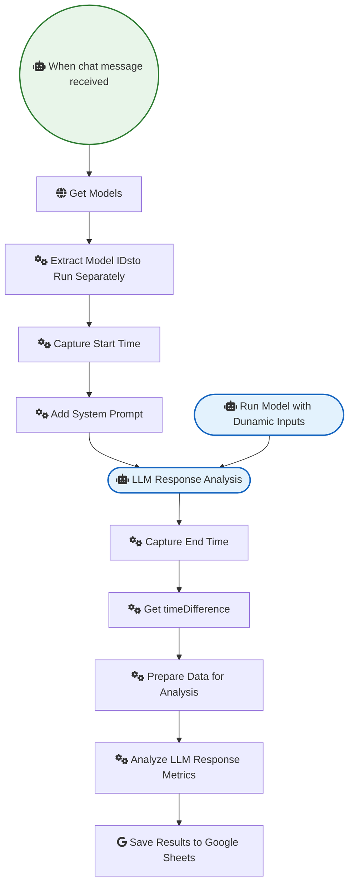

```mermaid
graph TD
    classDef trigger fill:#e8f5e9,stroke:#2e7d32,stroke-width:2px;
    classDef ai fill:#e3f2fd,stroke:#1565c0,stroke-width:2px;
    classDef logic fill:#fff3e0,stroke:#ef6c00,stroke-width:2px;

    Get_Models["fas:fa-globe Get Models"]
    When_chat_message_received(("fas:fa-robot When chat message received")):::trigger
    Get_timeDifference["fas:fa-cogs Get timeDifference"]
    Run_Model_with_Dunamic_Inputs(["fas:fa-robot Run Model with Dunamic Inputs"]):::ai
    Analyze_LLM_Response_Metrics["fas:fa-cogs Analyze LLM Response Metrics"]
    Save_Results_to_Google_Sheets["fab:fa-google Save Results to Google Sheets"]
    Capture_End_Time["fas:fa-cogs Capture End Time"]
    Capture_Start_Time["fas:fa-cogs Capture Start Time"]
    Prepare_Data_for_Analysis["fas:fa-cogs Prepare Data for Analysis"]
    Extract_Model_IDsto_Run_Separately["fas:fa-cogs Extract Model IDsto Run Separately"]
    Add_System_Prompt["fas:fa-cogs Add System Prompt"]
    LLM_Response_Analysis(["fas:fa-robot LLM Response Analysis"]):::ai

    Get_Models --> Extract_Model_IDsto_Run_Separately
    Capture_End_Time --> Get_timeDifference
    Add_System_Prompt --> LLM_Response_Analysis
    Capture_Start_Time --> Add_System_Prompt
    Get_timeDifference --> Prepare_Data_for_Analysis
    LLM_Response_Analysis --> Capture_End_Time
    Prepare_Data_for_Analysis --> Analyze_LLM_Response_Metrics
    When_chat_message_received --> Get_Models
    Analyze_LLM_Response_Metrics --> Save_Results_to_Google_Sheets
    Run_Model_with_Dunamic_Inputs --> LLM_Response_Analysis
    Extract_Model_IDsto_Run_Separately --> Capture_Start_Time
```
