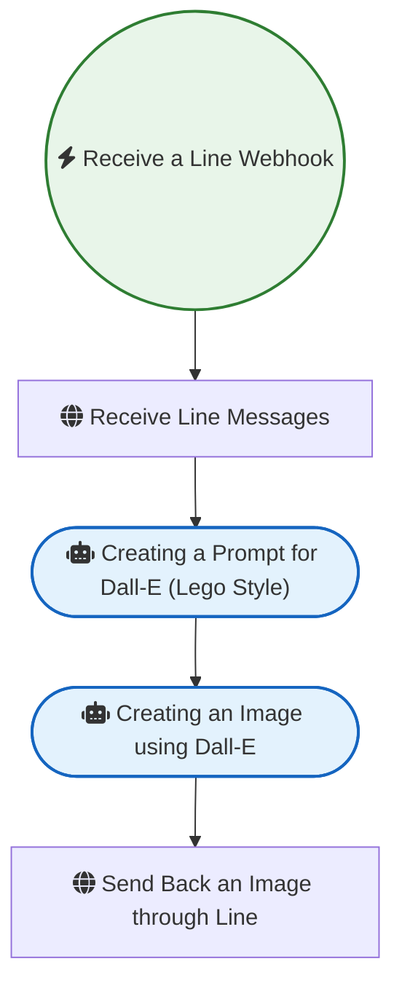

```mermaid
graph TD
    classDef trigger fill:#e8f5e9,stroke:#2e7d32,stroke-width:2px;
    classDef ai fill:#e3f2fd,stroke:#1565c0,stroke-width:2px;
    classDef logic fill:#fff3e0,stroke:#ef6c00,stroke-width:2px;

    Receive_a_Line_Webhook(("fas:fa-bolt Receive a Line Webhook")):::trigger
    Receive_Line_Messages["fas:fa-globe Receive Line Messages"]
    Creating_an_Image_using_Dall_E(["fas:fa-robot Creating an Image using Dall-E"]):::ai
    Creating_a_Prompt_for_Dall_E__Lego_Style_(["fas:fa-robot Creating a Prompt for Dall-E (Lego Style)"]):::ai
    Send_Back_an_Image_through_Line["fas:fa-globe Send Back an Image through Line"]

    Receive_Line_Messages --> Creating_a_Prompt_for_Dall_E__Lego_Style_
    Receive_a_Line_Webhook --> Receive_Line_Messages
    Creating_an_Image_using_Dall_E --> Send_Back_an_Image_through_Line
    Creating_a_Prompt_for_Dall_E__Lego_Style_ --> Creating_an_Image_using_Dall_E
```
