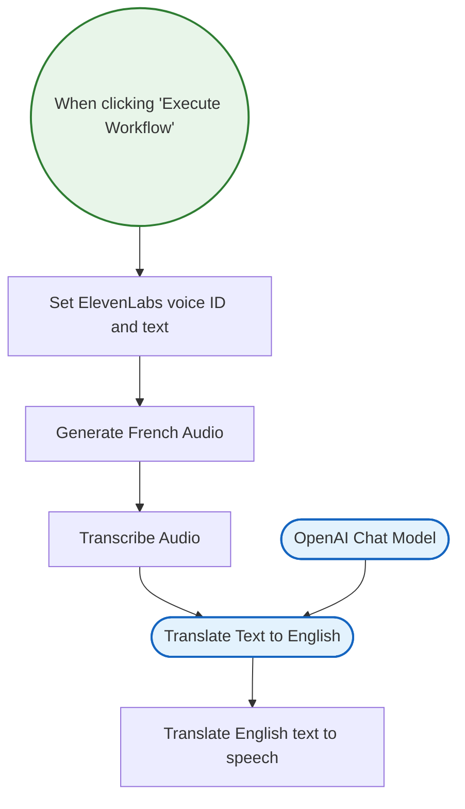

```mermaid
graph TD
    classDef trigger fill:#e8f5e9,stroke:#2e7d32,stroke-width:2px;
    classDef ai fill:#e3f2fd,stroke:#1565c0,stroke-width:2px;
    classDef logic fill:#fff3e0,stroke:#ef6c00,stroke-width:2px;

    OpenAI_Chat_Model(["OpenAI Chat Model"]):::ai
    When_clicking__Execute_Workflow_(("When clicking 'Execute Workflow'")):::trigger
    Generate_French_Audio["Generate French Audio"]
    Set_ElevenLabs_voice_ID_and_text["Set ElevenLabs voice ID and text"]
    Translate_Text_to_English(["Translate Text to English"]):::ai
    Translate_English_text_to_speech["Translate English text to speech"]
    Transcribe_Audio["Transcribe Audio"]

    Transcribe_Audio --> Translate_Text_to_English
    OpenAI_Chat_Model --> Translate_Text_to_English
    Generate_French_Audio --> Transcribe_Audio
    Translate_Text_to_English --> Translate_English_text_to_speech
    Set_ElevenLabs_voice_ID_and_text --> Generate_French_Audio
    When_clicking__Execute_Workflow_ --> Set_ElevenLabs_voice_ID_and_text
```
