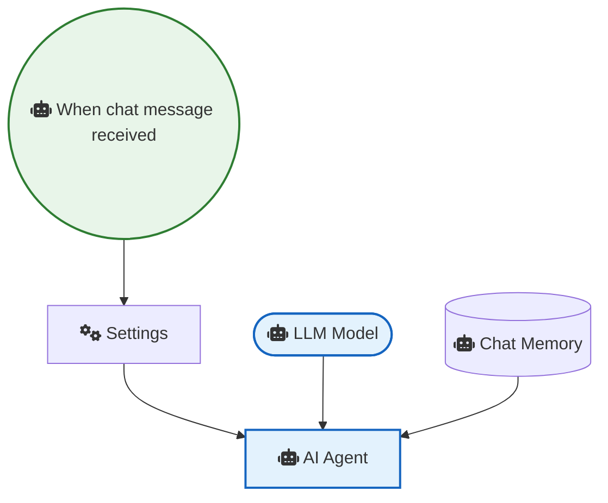

```mermaid
graph TD
    classDef trigger fill:#e8f5e9,stroke:#2e7d32,stroke-width:2px;
    classDef ai fill:#e3f2fd,stroke:#1565c0,stroke-width:2px;
    classDef logic fill:#fff3e0,stroke:#ef6c00,stroke-width:2px;

    Settings["fas:fa-cogs Settings"]
    When_chat_message_received(("fas:fa-robot When chat message received")):::trigger
    AI_Agent["fas:fa-robot AI Agent"]:::ai
    Chat_Memory[("fas:fa-robot Chat Memory")]
    LLM_Model(["fas:fa-robot LLM Model"]):::ai

    Settings --> AI_Agent
    LLM_Model --> AI_Agent
    Chat_Memory --> AI_Agent
    When_chat_message_received --> Settings
```
