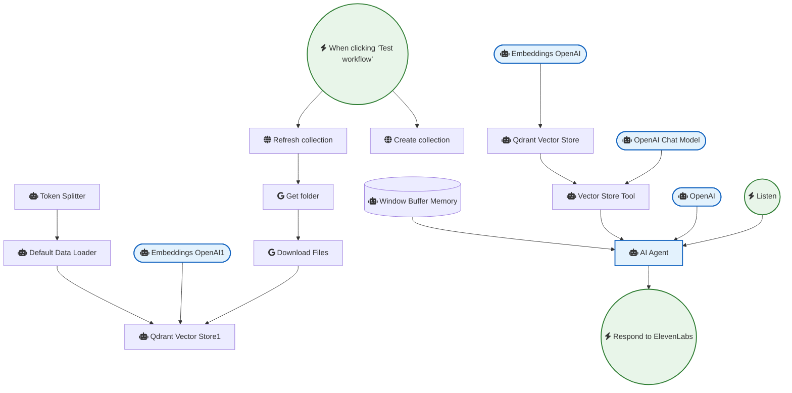

```mermaid
graph TD
    classDef trigger fill:#e8f5e9,stroke:#2e7d32,stroke-width:2px;
    classDef ai fill:#e3f2fd,stroke:#1565c0,stroke-width:2px;
    classDef logic fill:#fff3e0,stroke:#ef6c00,stroke-width:2px;

    AI_Agent["fas:fa-robot AI Agent"]:::ai
    Vector_Store_Tool["fas:fa-robot Vector Store Tool"]
    Qdrant_Vector_Store["fas:fa-robot Qdrant Vector Store"]
    Embeddings_OpenAI(["fas:fa-robot Embeddings OpenAI"]):::ai
    When_clicking__Test_workflow_(("fas:fa-bolt When clicking ‘Test workflow’")):::trigger
    Create_collection["fas:fa-globe Create collection"]
    Refresh_collection["fas:fa-globe Refresh collection"]
    Get_folder["fab:fa-google Get folder"]
    Download_Files["fab:fa-google Download Files"]
    Default_Data_Loader["fas:fa-robot Default Data Loader"]
    Token_Splitter["fas:fa-robot Token Splitter"]
    Qdrant_Vector_Store1["fas:fa-robot Qdrant Vector Store1"]
    Embeddings_OpenAI1(["fas:fa-robot Embeddings OpenAI1"]):::ai
    Respond_to_ElevenLabs(("fas:fa-bolt Respond to ElevenLabs")):::trigger
    OpenAI(["fas:fa-robot OpenAI"]):::ai
    Listen(("fas:fa-bolt Listen")):::trigger
    Window_Buffer_Memory[("fas:fa-robot Window Buffer Memory")]
    OpenAI_Chat_Model(["fas:fa-robot OpenAI Chat Model"]):::ai

    Listen --> AI_Agent
    OpenAI --> AI_Agent
    AI_Agent --> Respond_to_ElevenLabs
    Get_folder --> Download_Files
    Download_Files --> Qdrant_Vector_Store1
    Token_Splitter --> Default_Data_Loader
    Embeddings_OpenAI --> Qdrant_Vector_Store
    OpenAI_Chat_Model --> Vector_Store_Tool
    Vector_Store_Tool --> AI_Agent
    Embeddings_OpenAI1 --> Qdrant_Vector_Store1
    Refresh_collection --> Get_folder
    Default_Data_Loader --> Qdrant_Vector_Store1
    Qdrant_Vector_Store --> Vector_Store_Tool
    Window_Buffer_Memory --> AI_Agent
    When_clicking__Test_workflow_ --> Create_collection
    When_clicking__Test_workflow_ --> Refresh_collection
```
