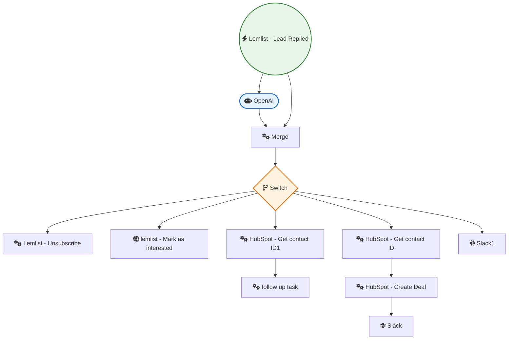

```mermaid
graph TD
    classDef trigger fill:#e8f5e9,stroke:#2e7d32,stroke-width:2px;
    classDef ai fill:#e3f2fd,stroke:#1565c0,stroke-width:2px;
    classDef logic fill:#fff3e0,stroke:#ef6c00,stroke-width:2px;

    Lemlist___Unsubscribe["fas:fa-cogs Lemlist - Unsubscribe"]
    follow_up_task["fas:fa-cogs follow up task"]
    Switch{"fas:fa-code-branch Switch"}:::logic
    Merge["fas:fa-cogs Merge"]
    lemlist___Mark_as_interested["fas:fa-globe lemlist - Mark as interested"]
    HubSpot___Create_Deal["fas:fa-cogs HubSpot - Create Deal"]
    HubSpot___Get_contact_ID["fas:fa-cogs HubSpot - Get contact ID"]
    Slack["fab:fa-slack Slack"]
    HubSpot___Get_contact_ID1["fas:fa-cogs HubSpot - Get contact ID1"]
    Slack1["fab:fa-slack Slack1"]
    Lemlist___Lead_Replied(("fas:fa-bolt Lemlist - Lead Replied")):::trigger
    OpenAI(["fas:fa-robot OpenAI"]):::ai

    Merge --> Switch
    OpenAI --> Merge
    Switch --> Lemlist___Unsubscribe
    Switch --> lemlist___Mark_as_interested
    Switch --> HubSpot___Get_contact_ID
    Switch --> HubSpot___Get_contact_ID1
    Switch --> Slack1
    HubSpot___Create_Deal --> Slack
    Lemlist___Lead_Replied --> OpenAI
    Lemlist___Lead_Replied --> Merge
    HubSpot___Get_contact_ID --> HubSpot___Create_Deal
    HubSpot___Get_contact_ID1 --> follow_up_task
```
